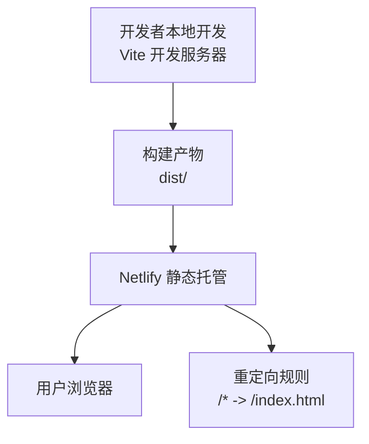
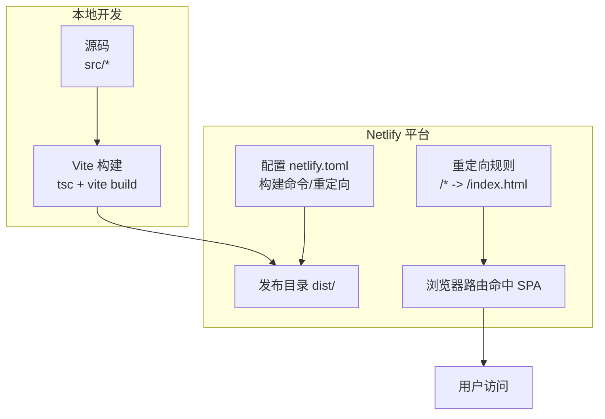
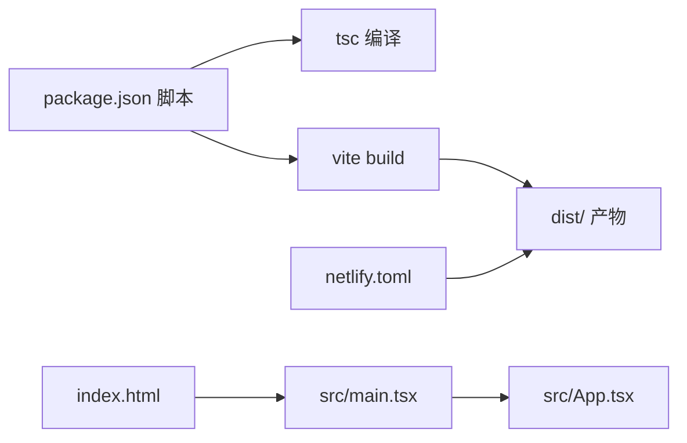

# 部署指南

<cite>
**本文引用的文件**
- [netlify.toml](file://netlify.toml)
- [vite.config.ts](file://vite.config.ts)
- [package.json](file://package.json)
- [tsconfig.json](file://tsconfig.json)
- [index.html](file://index.html)
- [src/main.tsx](file://src/main.tsx)
- [src/App.tsx](file://src/App.tsx)
</cite>

## 目录
1. [简介](#简介)
2. [项目结构](#项目结构)
3. [核心组件](#核心组件)
4. [架构总览](#架构总览)
5. [详细组件分析](#详细组件分析)
6. [依赖分析](#依赖分析)
7. [性能考虑](#性能考虑)
8. [故障排除指南](#故障排除指南)
9. [结论](#结论)
10. [附录](#附录)

## 简介
本指南面向运维与开发团队，提供小天AI教育平台在Netlify上的完整部署方案。内容涵盖构建配置、环境变量、域名与重定向、Vite优化策略、生产部署步骤、CI/CD自动化建议、性能与安全最佳实践、监控与日志配置以及故障排除与回滚策略。

## 项目结构
该前端项目采用React + Vite + TypeScript技术栈，使用React Router进行单页路由；Netlify作为静态站点托管，通过配置文件定义构建命令与重定向规则，确保SPA在刷新或直连路径时能正确返回入口页面。

图表来源
- [netlify.toml:1-9](file://netlify.toml#L1-L9)
- [vite.config.ts:1-12](file://vite.config.ts#L1-L12)
- [package.json:6-10](file://package.json#L6-L10)

章节来源
- [netlify.toml:1-9](file://netlify.toml#L1-L9)
- [vite.config.ts:1-12](file://vite.config.ts#L1-L12)
- [package.json:6-10](file://package.json#L6-L10)

## 核心组件
- 构建脚本与产物目录：通过包管理脚本触发TypeScript编译与Vite打包，输出至dist目录供Netlify发布。
- 构建配置：Vite插件启用React与TailwindCSS，开发服务器支持跨主机访问与本地隧道域名白名单。
- SPA路由：index.html仅包含根容器，实际路由由React Router在客户端处理，需通过Netlify重定向规则将所有路径回退到index.html。
- 类型与模块解析：tsconfig采用bundler模式，确保与Vite打包器兼容。

章节来源
- [package.json:6-10](file://package.json#L6-L10)
- [vite.config.ts:1-12](file://vite.config.ts#L1-L12)
- [tsconfig.json:1-25](file://tsconfig.json#L1-L25)
- [index.html:1-14](file://index.html#L1-L14)

## 架构总览
下图展示从代码提交到用户访问的关键路径，强调构建、发布与路由重写三要素。

图表来源
- [netlify.toml:1-9](file://netlify.toml#L1-L9)
- [package.json:6-10](file://package.json#L6-L10)
- [index.html:1-14](file://index.html#L1-L14)

## 详细组件分析

### Netlify 构建与重定向配置
- 构建命令与发布目录：构建命令由包脚本统一管理，发布目录指向dist，确保静态资源被正确托管。
- 路由重定向：将所有路径重写到index.html，使前端路由可直接访问与刷新生效。
- 函数与内部目录：仓库包含.Netlify目录，但当前未见函数实现；如无函数需求，可忽略functions-internal等目录。

章节来源
- [netlify.toml:1-9](file://netlify.toml#L1-L9)

### Vite 构建工具配置与优化
- 插件生态：启用React与TailwindCSS插件，满足UI与样式构建需求。
- 开发服务器：允许外部访问与本地隧道域名白名单，便于联调与预览。
- 生产优化建议（基于现有配置的扩展方向）：
  - 按需加载与代码分割：利用Vite动态导入能力拆分路由级组件，减少首屏体积。
  - 预构建依赖：对稳定第三方库启用预构建，缩短冷启动时间。
  - 资源压缩与哈希：保持默认生产打包行为，必要时开启更严格的压缩策略。
  - 静态资源优化：合理放置public资源，避免不必要的打包；对图片等资源进行压缩与格式优化。
  - Source Map：生产环境谨慎开启，平衡调试价值与安全风险。

章节来源
- [vite.config.ts:1-12](file://vite.config.ts#L1-L12)

### TypeScript 编译配置
- 模块解析：bundler模式与严格类型检查配合，提升打包一致性与类型安全性。
- 输出目标：ES2023与现代浏览器特性结合，确保兼容性与性能。

章节来源
- [tsconfig.json:1-25](file://tsconfig.json#L1-L25)

### 入口与路由结构
- HTML入口：仅包含根容器与入口脚本，其余逻辑由React应用负责。
- 应用路由：BrowserRouter + 多个页面路由，覆盖教学、练习、报告等核心场景。
- 布局与页面：主布局与多页面组件构成完整用户体验。

章节来源
- [index.html:1-14](file://index.html#L1-L14)
- [src/main.tsx:1-11](file://src/main.tsx#L1-L11)
- [src/App.tsx:1-64](file://src/App.tsx#L1-L64)

### CI/CD 流水线与自动化部署（建议）
以下为通用建议，帮助团队建立自动化部署流程：
- 触发条件：主分支推送、标签推送或PR合并。
- 步骤建议：
  1) 安装依赖与缓存
  2) 运行类型检查与单元测试（如有）
  3) 执行构建命令生成dist
  4) 使用Netlify CLI或平台提供的部署入口上传dist
  5) 部署后运行健康检查（可选）
- 环境变量：在CI中注入Netlify部署所需的认证信息与站点ID；在Netlify后台配置站点级环境变量（如API端点、功能开关等）。
- 分支策略：预发布环境映射到特定分支；生产环境仅接受受控合并。
- 回滚：保留最近几个版本的构建工件，必要时通过CLI或控制台回滚至上一个稳定版本。

说明：本仓库未包含CI配置文件，以上为通用实践建议。

## 依赖分析
- 构建链路：package.json中的脚本驱动TypeScript与Vite完成编译与打包；Vite读取vite.config.ts与tsconfig.json，最终输出dist。
- 运行时链路：index.html加载入口脚本，main.tsx渲染App，App内定义路由，实现SPA导航。
- 平台适配：netlify.toml声明构建命令与重定向，保证Netlify正确托管与路由。

图表来源
- [package.json:6-10](file://package.json#L6-L10)
- [vite.config.ts:1-12](file://vite.config.ts#L1-L12)
- [tsconfig.json:1-25](file://tsconfig.json#L1-L25)
- [index.html:1-14](file://index.html#L1-L14)
- [src/main.tsx:1-11](file://src/main.tsx#L1-L11)
- [src/App.tsx:1-64](file://src/App.tsx#L1-L64)
- [netlify.toml:1-9](file://netlify.toml#L1-L9)

章节来源
- [package.json:6-10](file://package.json#L6-L10)
- [vite.config.ts:1-12](file://vite.config.ts#L1-L12)
- [tsconfig.json:1-25](file://tsconfig.json#L1-L25)
- [index.html:1-14](file://index.html#L1-L14)
- [src/main.tsx:1-11](file://src/main.tsx#L1-L11)
- [src/App.tsx:1-64](file://src/App.tsx#L1-L64)
- [netlify.toml:1-9](file://netlify.toml#L1-L9)

## 性能考虑
- 构建优化
  - 合理拆分路由级组件，减少首屏加载体积。
  - 对不常变更的第三方库启用预构建，降低重复计算。
  - 控制静态资源体积，优先使用现代格式与压缩算法。
- 运行时优化
  - 利用浏览器缓存策略与资源指纹，提升二次访问速度。
  - 在Netlify上启用Gzip/Brotli压缩与CDN加速。
  - 避免在首屏传输大文件，按需懒加载。
- 可观测性
  - 在Netlify控制台查看构建日志与部署状态。
  - 结合浏览器开发者工具分析网络与性能瓶颈。

## 故障排除指南
- 404 或刷新空白页
  - 检查netlify.toml中的重定向规则是否正确，确保所有路径指向index.html。
  - 确认构建命令与发布目录一致，dist中包含完整产物。
- 路由异常
  - 确保index.html仅包含根容器，路由由React Router接管。
  - 检查App路由配置是否覆盖目标路径。
- 构建失败
  - 查看CI或本地构建日志，确认TypeScript与Vite版本兼容性。
  - 核对tsconfig与vite.config的模块解析与插件配置。
- 开发服务器无法访问
  - 检查host与allowedHosts配置，确保允许外部访问与本地隧道域名。

章节来源
- [netlify.toml:5-9](file://netlify.toml#L5-L9)
- [index.html:1-14](file://index.html#L1-L14)
- [src/App.tsx:28-64](file://src/App.tsx#L28-L64)
- [vite.config.ts:7-11](file://vite.config.ts#L7-L11)
- [package.json:6-10](file://package.json#L6-L10)

## 结论
本指南提供了小天AI教育平台在Netlify上的部署与运维要点：以netlify.toml定义构建与重定向，以Vite与TypeScript保障构建质量，以路由重写与CDN实现高性能访问。建议结合CI/CD自动化与监控日志体系，持续优化性能与稳定性。

## 附录

### 生产环境部署步骤
- 准备工作
  - 确保本地构建成功，dist目录完整。
  - 在Netlify后台配置站点与域名，设置构建命令与发布目录。
- 部署执行
  - 通过Netlify CLI或平台控制台上传dist。
  - 验证首页与关键路由可正常访问。
- 收尾
  - 设置HTTPS与安全头（如适用）。
  - 配置监控与日志收集。

### 环境变量与域名配置
- 环境变量
  - 在Netlify后台的“Site settings > Build & deploy > Environment”中添加键值对。
  - 常见用途：API端点、功能开关、分析服务密钥等。
- 域名
  - 在“Domain management”中绑定自定义域名，并配置DNS记录。
  - 确保SSL证书自动续期与CNAME/A记录正确。

### 监控与日志
- 构建与部署日志：在Netlify控制台查看每次构建的详细输出。
- 运行时监控：结合浏览器性能面板与网络面板定位问题。
- 错误追踪：可接入错误上报服务（如浏览器端SDK），在生产环境收集异常信息。

### 回滚策略
- 版本保留：保留最近几个稳定版本的构建工件。
- 快速回滚：通过Netlify控制台选择历史版本进行回滚。
- 安全回滚：若发现严重问题，立即回滚至上一稳定版本并发布修复版本。