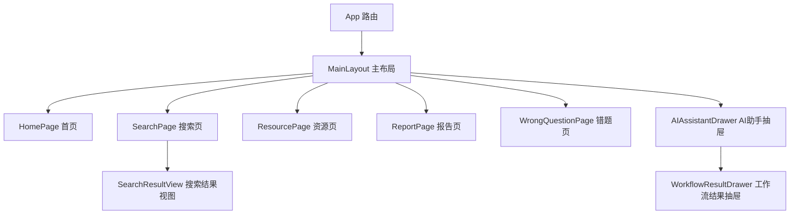
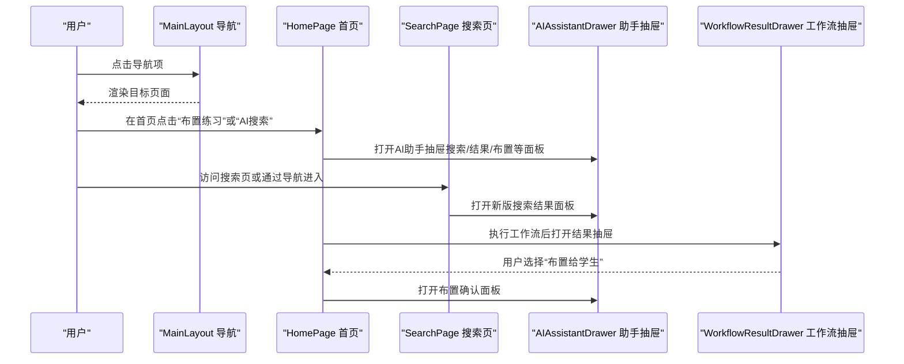
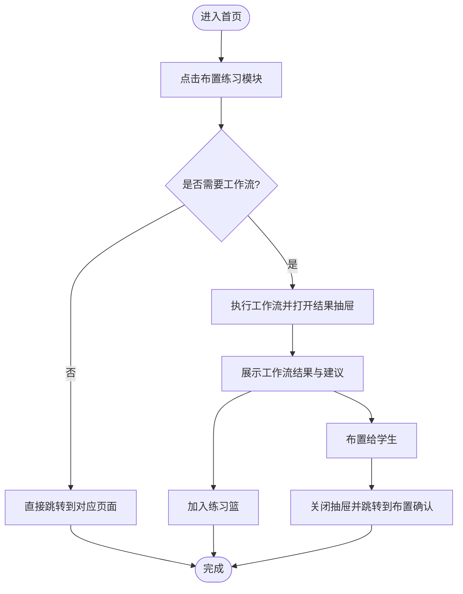
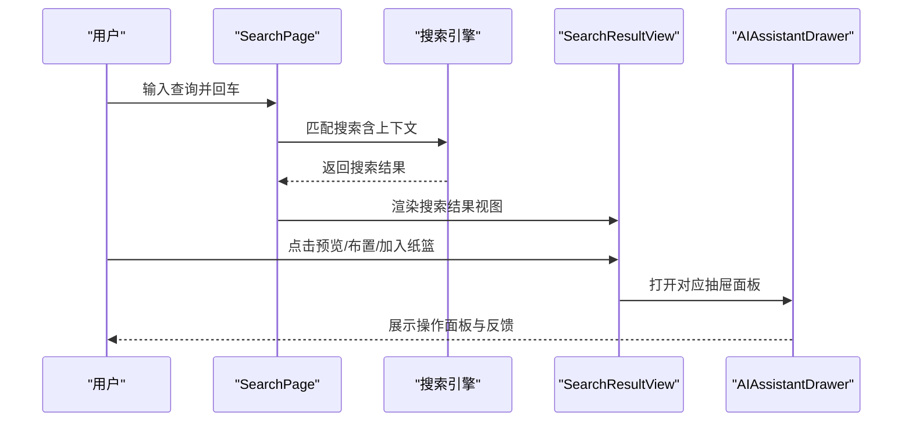
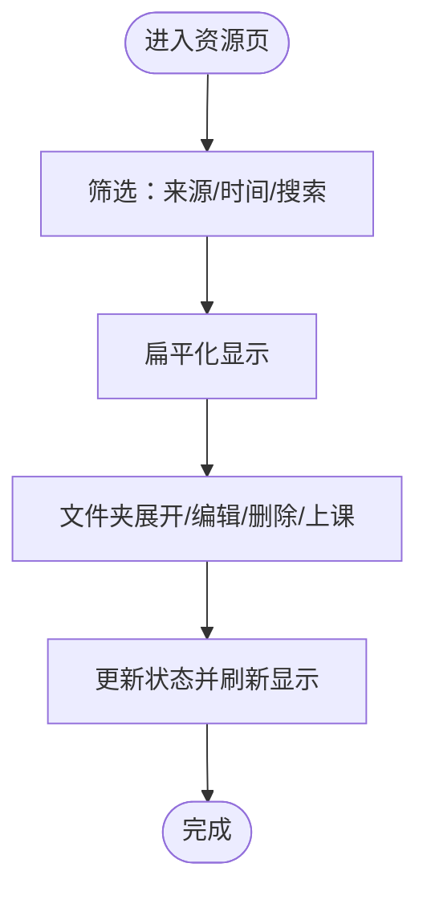
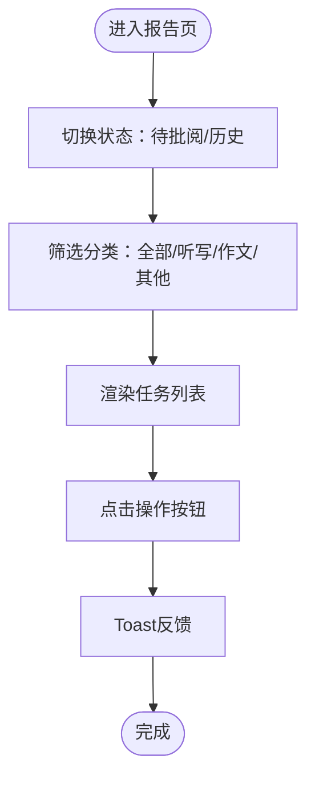
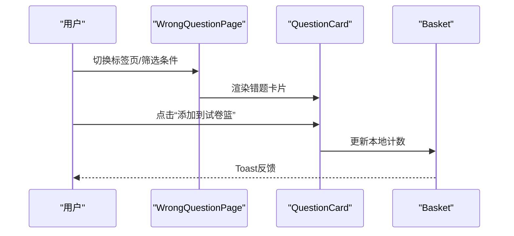
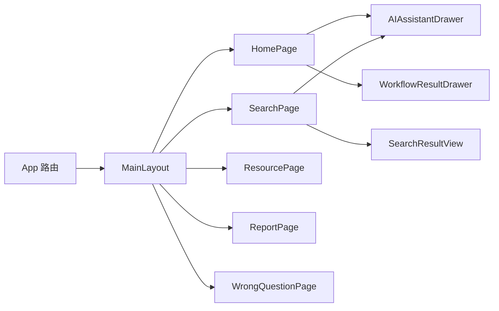

# 主要页面组件

<cite>
**本文引用的文件**
- [App.tsx](file://src/App.tsx)
- [MainLayout.tsx](file://src/layouts/MainLayout.tsx)
- [HomePage.tsx](file://src/pages/HomePage.tsx)
- [SearchPage.tsx](file://src/pages/SearchPage.tsx)
- [ResourcePage.tsx](file://src/pages/ResourcePage.tsx)
- [ReportPage.tsx](file://src/pages/ReportPage.tsx)
- [WrongQuestionPage.tsx](file://src/pages/WrongQuestionPage.tsx)
- [AIAssistantDrawer.tsx](file://src/ai/components/AIAssistantDrawer.tsx)
- [WorkflowResultDrawer.tsx](file://src/ai/components/WorkflowResultDrawer.tsx)
- [SearchResultView.tsx](file://src/ai/components/search-new/SearchResultView.tsx)
- [style.css](file://src/style.css)
</cite>

## 目录
1. [简介](#简介)
2. [项目结构](#项目结构)
3. [核心组件](#核心组件)
4. [架构总览](#架构总览)
5. [详细组件分析](#详细组件分析)
6. [依赖分析](#依赖分析)
7. [性能考虑](#性能考虑)
8. [故障排查指南](#故障排查指南)
9. [结论](#结论)
10. [附录](#附录)

## 简介
本技术文档聚焦于小天AI教育平台的主要页面组件，系统梳理首页、搜索页面、资源页面、报告页面与错题页面的组件结构、状态管理与用户交互逻辑，并阐明页面间导航关系与数据流转机制。同时给出响应式设计与用户体验优化策略、扩展开发指南与最佳实践，帮助开发者快速理解与高效迭代这些核心页面。

## 项目结构
- 页面路由与布局由应用入口统一配置，采用主布局容器包裹所有页面，提供全局导航与右侧AI抽屉。
- 页面组件以功能域划分，首页负责布置练习、课堂教学、资源推荐与练习报告聚合；搜索页面提供新版搜索体验；资源页面管理备课资源；报告页面聚焦智能阅卷任务；错题页面支持班级/学生维度的错题分析与筛选。

图表来源
- [App.tsx:28-63](file://src/App.tsx#L28-L63)
- [MainLayout.tsx:32-214](file://src/layouts/MainLayout.tsx#L32-L214)
- [HomePage.tsx:107-464](file://src/pages/HomePage.tsx#L107-L464)
- [SearchPage.tsx:27-248](file://src/pages/SearchPage.tsx#L27-L248)
- [ResourcePage.tsx:75-311](file://src/pages/ResourcePage.tsx#L75-L311)
- [ReportPage.tsx:126-301](file://src/pages/ReportPage.tsx#L126-L301)
- [WrongQuestionPage.tsx:251-504](file://src/pages/WrongQuestionPage.tsx#L251-L504)
- [AIAssistantDrawer.tsx:54-555](file://src/ai/components/AIAssistantDrawer.tsx#L54-L555)
- [WorkflowResultDrawer.tsx:44-251](file://src/ai/components/WorkflowResultDrawer.tsx#L44-L251)
- [SearchResultView.tsx:31-184](file://src/ai/components/search-new/SearchResultView.tsx#L31-L184)

章节来源
- [App.tsx:28-63](file://src/App.tsx#L28-L63)
- [MainLayout.tsx:32-214](file://src/layouts/MainLayout.tsx#L32-L214)

## 核心组件
- 主布局与导航：提供顶部栏、左侧导航、移动端侧边栏、返回/最小化控制以及全局AI抽屉入口。
- 首页：布置练习模块、课堂教学模块、更多课本滚动卡片、小天AI搜索框、教学关注洞察、练习报告列表。
- 搜索页：新版搜索引擎集成，支持上下文感知、结果分组、函数入口、快速条目与批量布置确认。
- 资源页：备课资源列表，支持来源过滤、时间范围筛选、搜索、文件夹展开/折叠、加入练习篮、布置等。
- 报告页：智能阅卷任务列表，支持状态切换、分类标签、重阅记录、练习重阅等。
- 错题页：班级/学生双标签页、时间/类型/题型筛选、错题卡片、音频播放器、试卷篮联动。

章节来源
- [MainLayout.tsx:32-214](file://src/layouts/MainLayout.tsx#L32-L214)
- [HomePage.tsx:107-464](file://src/pages/HomePage.tsx#L107-L464)
- [SearchPage.tsx:27-248](file://src/pages/SearchPage.tsx#L27-L248)
- [ResourcePage.tsx:75-311](file://src/pages/ResourcePage.tsx#L75-L311)
- [ReportPage.tsx:126-301](file://src/pages/ReportPage.tsx#L126-L301)
- [WrongQuestionPage.tsx:251-504](file://src/pages/WrongQuestionPage.tsx#L251-L504)

## 架构总览
页面组件通过React Router进行路由组织，主布局负责全局导航与抽屉容器。AI助手抽屉作为右侧工作台承载多种面板（资源预览、布置确认、练习篮、生成内容、洞察详情等），工作流结果抽屉用于展示AI工作流执行过程与输出。搜索页通过新版搜索结果视图渲染资源分组与函数入口。

图表来源
- [MainLayout.tsx:132-154](file://src/layouts/MainLayout.tsx#L132-L154)
- [HomePage.tsx:118-173](file://src/pages/HomePage.tsx#L118-L173)
- [SearchPage.tsx:76-88](file://src/pages/SearchPage.tsx#L76-L88)
- [AIAssistantDrawer.tsx:54-555](file://src/ai/components/AIAssistantDrawer.tsx#L54-L555)
- [WorkflowResultDrawer.tsx:44-251](file://src/ai/components/WorkflowResultDrawer.tsx#L44-L251)

## 详细组件分析

### 首页组件（HomePage）
- 组件职责
  - 布置练习模块：提供同步、专项、模拟、趣味配音、时文阅读、主题视频、课后PK、选题组卷、试卷/答题卡、自定义批改等入口，部分模块触发工作流执行，部分直接跳转。
  - 课堂教学模块：提供同步教学、中考复习、作文练习、词汇PK等入口，使用渐变背景与图标增强视觉层次。
  - 更多课本：横向滚动卡片，支持左右滑动与标签展示。
  - 小天AI搜索：顶部搜索框，支持快捷键与占位提示，触发AI搜索或跳转搜索页。
  - 教学关注：基于洞察规则生成的洞察卡片，点击映射到对应教学洞察面板。
  - 练习报告：最近练习列表，支持“一键催”、“全屏讲解”、“报告”等操作。
- 状态管理
  - 工作流抽屉状态：打开/关闭、状态（加载/成功/失败）、结果、步骤名数组。
  - AI搜索状态：查询文本、抽屉面板切换。
  - 滚动状态：更多课本区域的左右滚动控制。
- 用户交互
  - 练习模块点击：根据模块类型决定跳转或工作流执行。
  - AI搜索：输入校验、回车提交、无输入提示。
  - 教学关注：点击洞察卡片打开对应教学洞察面板。
  - 报告列表：支持查看报告、一键催促、全屏讲解等。
- 数据流
  - 通过教师上下文（教材、年级、单元、班级、学生人数）驱动工作流与洞察生成。
  - 工作流执行完成后，通过工作流结果抽屉呈现输出与建议，并支持加入练习篮与布置。
- 响应式设计
  - 使用网格布局与弹性容器，左侧62%右侧38%，在小屏下自动换行与自适应。
  - 更多课本区域使用水平滚动与左右按钮控制。
- 性能与可用性
  - 搜索与工作流执行采用异步处理，避免阻塞UI。
  - 提供加载指示与错误状态反馈。
- 扩展与最佳实践
  - 新增练习模块时，遵循现有模块接口与颜色体系。
  - 工作流执行前统一收集上下文参数，确保一致性。
  - 对长列表采用虚拟化或分页策略（如后续扩展）。

图表来源
- [HomePage.tsx:118-173](file://src/pages/HomePage.tsx#L118-L173)
- [HomePage.tsx:181-464](file://src/pages/HomePage.tsx#L181-L464)
- [WorkflowResultDrawer.tsx:44-251](file://src/ai/components/WorkflowResultDrawer.tsx#L44-L251)

章节来源
- [HomePage.tsx:107-464](file://src/pages/HomePage.tsx#L107-L464)

### 搜索页面（SearchPage）
- 组件职责
  - 搜索框与占位提示，支持近期/趋势搜索标签。
  - 搜索结果视图：新版搜索结果面板，支持分组、函数入口、快速条目、纸篮联动。
  - 顶部上下文显示与纸篮徽章。
  - 加载态与空态提示。
- 状态管理
  - 查询参数：URL查询参数驱动自动运行。
  - 搜索状态：加载中/结果/空态。
  - 结果缓存：通过全局AI状态存储最新搜索结果。
  - 纸篮状态：全局状态维护练习篮数量与内容。
- 用户交互
  - 输入回车触发搜索，标签点击快速检索。
  - 预览、布置、加入纸篮、加入备课、打开功能、批量生成布置等。
- 数据流
  - 通过匹配引擎生成搜索结果，支持上下文注入（教材、年级、单元、班级、学生人数）。
  - 结果通过全局状态暴露给AI助手抽屉与搜索结果视图。
- 响应式设计
  - 顶部上下文与纸篮徽章自适应布局。
  - 搜索结果卡片在不同屏幕宽度下保持可读性。
- 性能与可用性
  - 搜索延迟模拟提升用户体验，避免闪烁。
  - 支持自动运行模式（URL参数）。
- 扩展与最佳实践
  - 新增搜索标签时，保持文案简洁与语义明确。
  - 为每个动作提供Toast反馈，保证用户感知。

图表来源
- [SearchPage.tsx:76-88](file://src/pages/SearchPage.tsx#L76-L88)
- [SearchPage.tsx:211-225](file://src/pages/SearchPage.tsx#L211-L225)
- [SearchResultView.tsx:31-184](file://src/ai/components/search-new/SearchResultView.tsx#L31-L184)
- [AIAssistantDrawer.tsx:441-484](file://src/ai/components/AIAssistantDrawer.tsx#L441-L484)

章节来源
- [SearchPage.tsx:27-248](file://src/pages/SearchPage.tsx#L27-L248)
- [SearchResultView.tsx:31-184](file://src/ai/components/search-new/SearchResultView.tsx#L31-L184)

### 资源页面（ResourcePage）
- 组件职责
  - 备课资源列表：支持来源类型过滤、时间范围筛选、标题搜索、文件夹展开/折叠。
  - 操作按钮：新建文件夹、编辑、删除、上课（预留）。
  - 浮动按钮：快速回到“我的备课”与折叠侧边栏。
- 状态管理
  - 列表状态：本地状态维护项目集合与过滤条件。
  - 搜索与筛选：实时过滤并扁平化显示。
- 用户交互
  - 文件夹点击展开/收起，子项缩进显示。
  - 来源类型下拉切换，日期范围输入。
  - 搜索框输入实时过滤。
- 数据流
  - 使用本地mock数据，支持未来接入真实数据源。
- 响应式设计
  - 列表区域自适应滚动，侧边浮动按钮在右侧固定定位。
- 性能与可用性
  - 扁平化算法仅在需要时计算，避免重复遍历。
  - 删除操作提供确认对话框。
- 扩展与最佳实践
  - 文件夹层级支持递归展开，注意性能与内存占用。
  - 操作按钮权限控制，避免未授权操作。

图表来源
- [ResourcePage.tsx:75-311](file://src/pages/ResourcePage.tsx#L75-L311)

章节来源
- [ResourcePage.tsx:75-311](file://src/pages/ResourcePage.tsx#L75-L311)

### 报告页面（ReportPage）
- 组件职责
  - 智能阅卷任务列表：支持待批阅/历史切换、分类标签（全部/听写纸/作文纸/其他试卷）、右侧操作按钮。
  - 任务卡片：标题、班级、截止时间、分类标签、操作按钮（查看报告/自动批阅/更多）。
  - 浮动按钮：快速回到“我的备课”与折叠侧边栏。
- 状态管理
  - 状态标签：待批阅/历史。
  - 分类标签：全部/听写纸批阅/作文纸批阅/其他试卷批阅。
- 用户交互
  - 切换状态与分类标签，点击任务卡片操作。
  - 使用教程、重阅记录、练习重阅等按钮（预留）。
- 数据流
  - 使用本地mock数据，支持未来接入真实任务数据。
- 响应式设计
  - 列表区域自适应滚动，浮动按钮在右侧固定定位。
- 性能与可用性
  - 任务列表按需渲染，预留懒加载空间。
- 扩展与最佳实践
  - 分类标签与状态切换应保持一致的视觉反馈。
  - 操作按钮提供Toast反馈，避免误操作。

图表来源
- [ReportPage.tsx:126-301](file://src/pages/ReportPage.tsx#L126-L301)

章节来源
- [ReportPage.tsx:126-301](file://src/pages/ReportPage.tsx#L126-L301)

### 错题页面（WrongQuestionPage）
- 组件职责
  - 双标签页：班级错题/学生错题。
  - 筛选区：班级、时间、类型、题型、错误率/得分率、知识点、练习名称、本页全部添加。
  - 错题卡片：题干、选项、音频播放器、答案解析、添加到试卷篮。
  - 浮动按钮：试卷篮计数、我的备课、折叠侧边栏。
- 状态管理
  - 标签页：班级/学生。
  - 筛选状态：时间、类型、题型集合、展开/收起。
  - 试卷篮计数：本地状态维护。
- 用户交互
  - 切换标签页、选择筛选条件、展开/收起筛选区、添加到试卷篮、查看答案解析。
- 数据流
  - 使用本地mock数据，支持未来接入真实错题数据。
- 响应式设计
  - 错题卡片在不同屏幕宽度下保持可读性，音频播放器紧凑布局。
- 性能与可用性
  - 音频播放器为轻量模拟，实际场景需接入真实音频API。
  - 本页全部添加按钮提供批量操作反馈。
- 扩展与最佳实践
  - 音频播放器应支持播放/暂停、进度条与剩余时间显示。
  - 试卷篮计数与全局状态联动，避免重复添加。

图表来源
- [WrongQuestionPage.tsx:251-504](file://src/pages/WrongQuestionPage.tsx#L251-L504)
- [WrongQuestionPage.tsx:163-247](file://src/pages/WrongQuestionPage.tsx#L163-L247)

章节来源
- [WrongQuestionPage.tsx:251-504](file://src/pages/WrongQuestionPage.tsx#L251-L504)

## 依赖分析
- 路由与布局
  - 应用路由集中配置，主布局统一承载导航与抽屉容器。
- 页面与AI组件
  - 首页与搜索页均依赖AI助手抽屉与工作流结果抽屉。
  - 搜索页通过新版搜索结果视图渲染搜索结果。
- 样式与主题
  - 使用TailwindCSS作为基础样式框架，全局样式引入工具类库。

图表来源
- [App.tsx:28-63](file://src/App.tsx#L28-L63)
- [MainLayout.tsx:32-214](file://src/layouts/MainLayout.tsx#L32-L214)
- [HomePage.tsx:107-464](file://src/pages/HomePage.tsx#L107-L464)
- [SearchPage.tsx:27-248](file://src/pages/SearchPage.tsx#L27-L248)
- [AIAssistantDrawer.tsx:54-555](file://src/ai/components/AIAssistantDrawer.tsx#L54-L555)
- [WorkflowResultDrawer.tsx:44-251](file://src/ai/components/WorkflowResultDrawer.tsx#L44-L251)
- [SearchResultView.tsx:31-184](file://src/ai/components/search-new/SearchResultView.tsx#L31-L184)

章节来源
- [App.tsx:28-63](file://src/App.tsx#L28-L63)
- [style.css:1-2](file://src/style.css#L1-L2)

## 性能考虑
- 异步加载与防抖
  - 首页工作流执行与搜索页结果渲染采用异步处理，避免主线程阻塞。
- 列表渲染优化
  - 资源页与错题页使用扁平化算法减少嵌套渲染成本。
- 抽屉动画与事件监听
  - AI助手抽屉与工作流结果抽屉采用CSS动画与键盘事件监听，保证交互流畅与可访问性。
- 样式与构建
  - TailwindCSS按需引入，减少打包体积；生产环境建议启用Tree Shaking与压缩。

## 故障排查指南
- 搜索无结果
  - 检查URL参数与自动运行逻辑，确认上下文参数是否正确传入。
  - 查看新版搜索结果视图的“无结果/不可识别”处理分支。
- 工作流执行失败
  - 检查工作流状态与步骤日志，确认步骤名称与结果数据结构。
  - 确认练习篮状态与加入逻辑。
- 抽屉无法关闭
  - 检查Esc键事件绑定与遮罩点击事件。
- 移动端导航异常
  - 检查侧边栏开关状态与触摸事件处理。

章节来源
- [SearchPage.tsx:61-74](file://src/pages/SearchPage.tsx#L61-L74)
- [AIAssistantDrawer.tsx:75-82](file://src/ai/components/AIAssistantDrawer.tsx#L75-L82)
- [WorkflowResultDrawer.tsx:44-251](file://src/ai/components/WorkflowResultDrawer.tsx#L44-L251)

## 结论
本文档对小天AI教育平台的主要页面组件进行了全面的技术梳理，覆盖了组件结构、状态管理、用户交互、数据流、导航关系与扩展实践。通过统一的主布局与AI抽屉体系，页面实现了良好的可维护性与可扩展性。建议在后续迭代中进一步完善音频播放器、真实数据接入与性能监控，持续提升用户体验与系统稳定性。

## 附录
- 响应式设计要点
  - 使用网格与弹性容器适配不同屏幕尺寸。
  - 固定定位的浮动按钮在移动端提供便捷操作。
- 用户体验优化
  - 提供加载态、空态与Toast反馈，增强用户感知。
  - 为关键操作提供快捷键与无障碍支持。
- 开发最佳实践
  - 统一状态管理模式，避免跨组件状态耦合。
  - 为每个页面提供清晰的职责边界与数据契约。
  - 为未来功能预留扩展点（如AI搜索页迁移、阅卷功能完善等）。