# 特殊页面组件

<cite>
**本文档引用的文件**
- [VocabularyPkPage.tsx](file://src/pages/VocabularyPkPage.tsx)
- [WritingPage.tsx](file://src/pages/WritingPage.tsx)
- [ListeningPage.tsx](file://src/pages/ListeningPage.tsx)
- [AssignAfterClassPkPage.tsx](file://src/pages/AssignAfterClassPkPage.tsx)
- [AssignMockPage.tsx](file://src/pages/AssignMockPage.tsx)
- [AssignReadingPage.tsx](file://src/pages/AssignReadingPage.tsx)
- [SpecializedInsightEntry.tsx](file://src/ai/components/SpecializedInsightEntry.tsx)
- [AssignPracticeTabs.tsx](file://src/components/AssignPracticeTabs.tsx)
- [ManualComposePage.tsx](file://src/pages/ManualComposePage.tsx)
- [WritingPracticePage.tsx](file://src/pages/WritingPracticePage.tsx)
- [WordTeachingPage.tsx](file://src/pages/WordTeachingPage.tsx)
- [AIAssistantDrawer.tsx](file://src/ai/components/AIAssistantDrawer.tsx)
- [teachingInsightGenerator.ts](file://src/ai/insights/teachingInsightGenerator.ts)
- [teachingInsightTypes.ts](file://src/ai/insights/teachingInsightTypes.ts)
- [index.ts](file://src/ai/store/index.ts)
</cite>

## 目录
1. [简介](#简介)
2. [项目结构](#项目结构)
3. [核心组件](#核心组件)
4. [架构总览](#架构总览)
5. [详细组件分析](#详细组件分析)
6. [依赖关系分析](#依赖关系分析)
7. [性能考虑](#性能考虑)
8. [故障排除指南](#故障排除指南)
9. [结论](#结论)
10. [附录](#附录)

## 简介
本技术文档聚焦小天AI教育平台的特殊页面组件，系统性阐述词汇PK页面、写作页面、听力页面、课后PK页面、模拟页面和阅读页面等专业教学功能页面的实现与集成。文档详细说明这些页面如何融合AI教学洞察与练习生成功能，解析页面的交互模式与教学流程，并提供个性化定制与扩展开发指南，帮助开发者快速构建与迭代专业教学页面。

## 项目结构
特殊页面组件主要分布在以下位置：
- 页面组件：位于 src/pages，涵盖词汇PK、写作、听力、课后PK、模拟、阅读等页面
- AI洞察入口：位于 src/ai/components，SpecializedInsightEntry 提供统一的洞察入口
- AI工作区：位于 src/ai/components/AIAssistantDrawer.tsx，承载布置确认、生成内容预览等面板
- AI洞察数据模型：位于 src/ai/insights，提供统一的洞察数据结构与生成器
- AI状态管理：位于 src/ai/store，提供全局状态与持久化能力

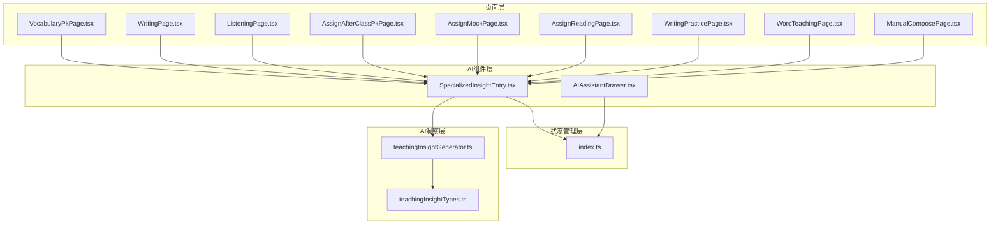

**图表来源**
- [VocabularyPkPage.tsx:1-189](file://src/pages/VocabularyPkPage.tsx#L1-L189)
- [WritingPage.tsx:1-144](file://src/pages/WritingPage.tsx#L1-L144)
- [ListeningPage.tsx:1-103](file://src/pages/ListeningPage.tsx#L1-L103)
- [AssignAfterClassPkPage.tsx:1-356](file://src/pages/AssignAfterClassPkPage.tsx#L1-L356)
- [AssignMockPage.tsx:1-121](file://src/pages/AssignMockPage.tsx#L1-L121)
- [AssignReadingPage.tsx:1-266](file://src/pages/AssignReadingPage.tsx#L1-L266)
- [SpecializedInsightEntry.tsx:1-157](file://src/ai/components/SpecializedInsightEntry.tsx#L1-L157)
- [AIAssistantDrawer.tsx:1-800](file://src/ai/components/AIAssistantDrawer.tsx#L1-L800)
- [teachingInsightGenerator.ts:1-388](file://src/ai/insights/teachingInsightGenerator.ts#L1-L388)
- [teachingInsightTypes.ts:1-191](file://src/ai/insights/teachingInsightTypes.ts#L1-L191)
- [index.ts:1-244](file://src/ai/store/index.ts#L1-L244)

**章节来源**
- [VocabularyPkPage.tsx:1-189](file://src/pages/VocabularyPkPage.tsx#L1-L189)
- [WritingPage.tsx:1-144](file://src/pages/WritingPage.tsx#L1-L144)
- [ListeningPage.tsx:1-103](file://src/pages/ListeningPage.tsx#L1-L103)
- [AssignAfterClassPkPage.tsx:1-356](file://src/pages/AssignAfterClassPkPage.tsx#L1-L356)
- [AssignMockPage.tsx:1-121](file://src/pages/AssignMockPage.tsx#L1-L121)
- [AssignReadingPage.tsx:1-266](file://src/pages/AssignReadingPage.tsx#L1-L266)
- [SpecializedInsightEntry.tsx:1-157](file://src/ai/components/SpecializedInsightEntry.tsx#L1-L157)
- [AIAssistantDrawer.tsx:1-800](file://src/ai/components/AIAssistantDrawer.tsx#L1-L800)
- [teachingInsightGenerator.ts:1-388](file://src/ai/insights/teachingInsightGenerator.ts#L1-L388)
- [teachingInsightTypes.ts:1-191](file://src/ai/insights/teachingInsightTypes.ts#L1-L191)
- [index.ts:1-244](file://src/ai/store/index.ts#L1-L244)

## 核心组件
- 词汇PK页面：提供单词PK、拼词PK、语用PK、综合练习四大模块，支持比赛模式切换与高频错词、记录等功能占位
- 写作页面：展示学生作文列表、批改状态与问题标签，支持上传作文与AI生成作文练习
- 听力页面：提供听力材料筛选、等级分类与AI生成定制听力材料入口
- 课后PK页面：布置课后PK的词表选择、PK形式筛选、已选篮管理与批量布置
- 模拟页面：布置模拟练习，支持年级、模块、栏目筛选与练习篮管理
- 阅读页面：布置阅读练习，支持难度、主题筛选与资源预览、加入备课与加入篮子
- AI洞察入口：SpecializedInsightEntry 统一生成并打开对应学科的洞察面板
- AI助手抽屉：AIAssistantDrawer 承载布置确认、生成内容预览、资源推荐等面板
- 洞察数据模型：teachingInsightGenerator 与 teachingInsightTypes 提供统一的洞察数据结构与生成逻辑
- 状态管理：AI Store 提供全局状态、持久化与工作流控制

**章节来源**
- [VocabularyPkPage.tsx:42-189](file://src/pages/VocabularyPkPage.tsx#L42-L189)
- [WritingPage.tsx:61-144](file://src/pages/WritingPage.tsx#L61-L144)
- [ListeningPage.tsx:21-103](file://src/pages/ListeningPage.tsx#L21-L103)
- [AssignAfterClassPkPage.tsx:42-356](file://src/pages/AssignAfterClassPkPage.tsx#L42-L356)
- [AssignMockPage.tsx:41-121](file://src/pages/AssignMockPage.tsx#L41-L121)
- [AssignReadingPage.tsx:43-266](file://src/pages/AssignReadingPage.tsx#L43-L266)
- [SpecializedInsightEntry.tsx:119-157](file://src/ai/components/SpecializedInsightEntry.tsx#L119-L157)
- [AIAssistantDrawer.tsx:54-555](file://src/ai/components/AIAssistantDrawer.tsx#L54-L555)
- [teachingInsightGenerator.ts:12-388](file://src/ai/insights/teachingInsightGenerator.ts#L12-L388)
- [teachingInsightTypes.ts:137-191](file://src/ai/insights/teachingInsightTypes.ts#L137-L191)
- [index.ts:140-244](file://src/ai/store/index.ts#L140-L244)

## 架构总览
特殊页面通过统一的AI洞察入口与AI助手抽屉，将教学洞察、练习生成与布置流程串联起来。页面组件负责用户交互与数据展示，AI洞察入口负责触发洞察生成，AI助手抽屉负责呈现与确认布置流程，状态管理负责持久化与跨页面共享。

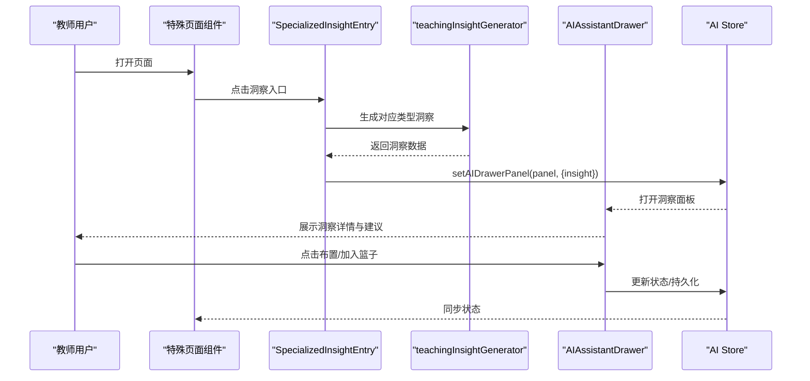

**图表来源**
- [SpecializedInsightEntry.tsx:119-157](file://src/ai/components/SpecializedInsightEntry.tsx#L119-L157)
- [teachingInsightGenerator.ts:12-19](file://src/ai/insights/teachingInsightGenerator.ts#L12-L19)
- [AIAssistantDrawer.tsx:293-308](file://src/ai/components/AIAssistantDrawer.tsx#L293-L308)
- [index.ts:140-244](file://src/ai/store/index.ts#L140-L244)

## 详细组件分析

### 词汇PK页面（VocabularyPkPage）
- 功能概述：提供单词PK、拼词PK、语用PK、综合练习四大模块卡片，支持模块内模式选择与比赛模式切换
- 交互要点：模块卡片悬停效果、按钮点击提示、高频错词与记录占位
- AI集成：页面顶部集成AI洞察入口，点击后打开词汇相关洞察面板

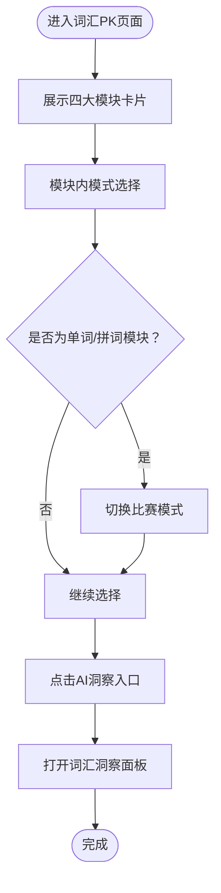

**图表来源**
- [VocabularyPkPage.tsx:42-189](file://src/pages/VocabularyPkPage.tsx#L42-L189)
- [SpecializedInsightEntry.tsx:119-157](file://src/ai/components/SpecializedInsightEntry.tsx#L119-L157)

**章节来源**
- [VocabularyPkPage.tsx:42-189](file://src/pages/VocabularyPkPage.tsx#L42-L189)
- [SpecializedInsightEntry.tsx:119-157](file://src/ai/components/SpecializedInsightEntry.tsx#L119-L157)

### 写作页面（WritingPage）
- 功能概述：展示学生作文列表，显示标题、作者、日期、状态与分数，支持问题标签展示与上传作文
- 交互要点：作文卡片头部分为“已批改”和“待批改”，点击“开始批改”进入批改流程
- AI集成：页面顶部集成写作洞察入口，点击后打开写作表现洞察面板

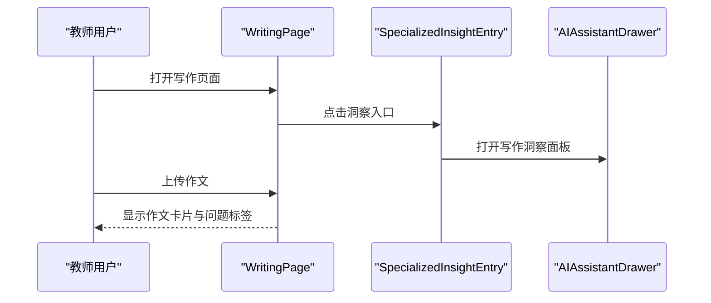

**图表来源**
- [WritingPage.tsx:61-144](file://src/pages/WritingPage.tsx#L61-L144)
- [SpecializedInsightEntry.tsx:119-157](file://src/ai/components/SpecializedInsightEntry.tsx#L119-L157)
- [AIAssistantDrawer.tsx:293-308](file://src/ai/components/AIAssistantDrawer.tsx#L293-L308)

**章节来源**
- [WritingPage.tsx:61-144](file://src/pages/WritingPage.tsx#L61-L144)
- [SpecializedInsightEntry.tsx:119-157](file://src/ai/components/SpecializedInsightEntry.tsx#L119-L157)
- [AIAssistantDrawer.tsx:293-308](file://src/ai/components/AIAssistantDrawer.tsx#L293-L308)

### 听力页面（ListeningPage）
- 功能概述：提供听力材料筛选（全部/单词/对话/场景/文化/视频）、当前单元选择与AI生成定制听力材料入口
- 交互要点：材料卡片展示类型、等级、时长与单元信息，支持打开按钮
- AI集成：页面顶部集成听说能力洞察入口，点击后打开听说能力洞察面板

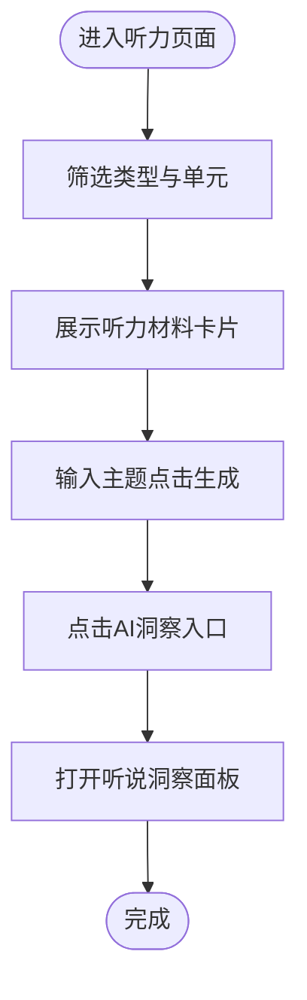

**图表来源**
- [ListeningPage.tsx:21-103](file://src/pages/ListeningPage.tsx#L21-L103)
- [SpecializedInsightEntry.tsx:119-157](file://src/ai/components/SpecializedInsightEntry.tsx#L119-L157)
- [AIAssistantDrawer.tsx:293-308](file://src/ai/components/AIAssistantDrawer.tsx#L293-L308)

**章节来源**
- [ListeningPage.tsx:21-103](file://src/pages/ListeningPage.tsx#L21-L103)
- [SpecializedInsightEntry.tsx:119-157](file://src/ai/components/SpecializedInsightEntry.tsx#L119-L157)
- [AIAssistantDrawer.tsx:293-308](file://src/ai/components/AIAssistantDrawer.tsx#L293-L308)

### 课后PK页面（AssignAfterClassPkPage）
- 功能概述：布置课后PK，支持PK形式筛选、词表选择、全选/课标词/重置、批量加入篮子、已选篮管理与布置
- 交互要点：左侧词卡网格滚动、底部工具栏、右侧已选篮内容与范围切换
- AI集成：页面顶部集成AI洞察入口，点击后打开词汇洞察面板

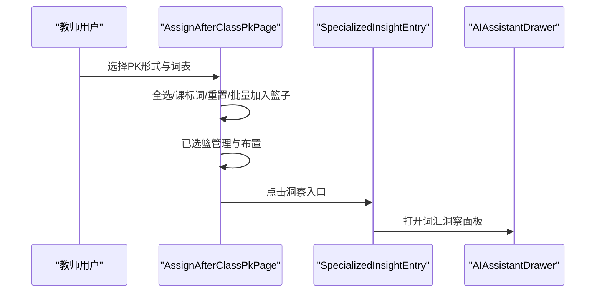

**图表来源**
- [AssignAfterClassPkPage.tsx:42-356](file://src/pages/AssignAfterClassPkPage.tsx#L42-L356)
- [SpecializedInsightEntry.tsx:119-157](file://src/ai/components/SpecializedInsightEntry.tsx#L119-L157)
- [AIAssistantDrawer.tsx:293-308](file://src/ai/components/AIAssistantDrawer.tsx#L293-L308)

**章节来源**
- [AssignAfterClassPkPage.tsx:42-356](file://src/pages/AssignAfterClassPkPage.tsx#L42-L356)
- [SpecializedInsightEntry.tsx:119-157](file://src/ai/components/SpecializedInsightEntry.tsx#L119-L157)
- [AIAssistantDrawer.tsx:293-308](file://src/ai/components/AIAssistantDrawer.tsx#L293-L308)

### 模拟页面（AssignMockPage）
- 功能概述：布置模拟练习，支持年级、模块、栏目筛选、展示筛选、搜索与练习篮管理
- 交互要点：表格展示练习名称、布置状态、题量、预计作答、难度与操作按钮
- AI集成：页面顶部集成AI洞察入口，点击后打开阶段练习洞察面板

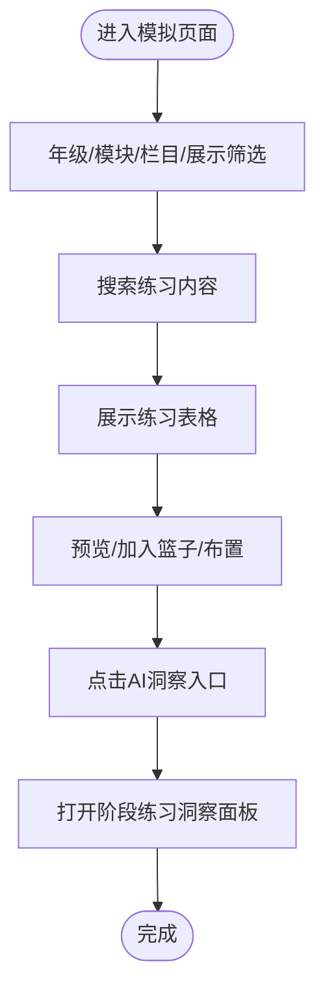

**图表来源**
- [AssignMockPage.tsx:41-121](file://src/pages/AssignMockPage.tsx#L41-L121)
- [SpecializedInsightEntry.tsx:119-157](file://src/ai/components/SpecializedInsightEntry.tsx#L119-L157)
- [AIAssistantDrawer.tsx:293-296](file://src/ai/components/AIAssistantDrawer.tsx#L293-L296)

**章节来源**
- [AssignMockPage.tsx:41-121](file://src/pages/AssignMockPage.tsx#L41-L121)
- [SpecializedInsightEntry.tsx:119-157](file://src/ai/components/SpecializedInsightEntry.tsx#L119-L157)
- [AIAssistantDrawer.tsx:293-296](file://src/ai/components/AIAssistantDrawer.tsx#L293-L296)

### 阅读页面（AssignReadingPage）
- 功能概述：布置阅读练习，支持难度筛选、主题筛选、展示筛选、搜索与资源预览、加入备课、加入篮子与布置
- 交互要点：两列资源网格展示封面、标题、难度、日期与操作按钮
- AI集成：页面顶部集成AI洞察入口，点击后打开阅读相关洞察面板

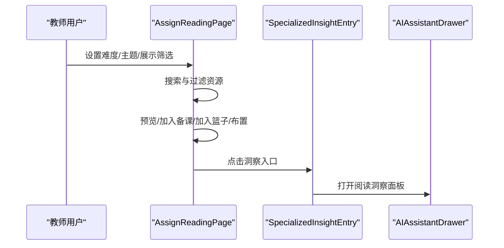

**图表来源**
- [AssignReadingPage.tsx:43-266](file://src/pages/AssignReadingPage.tsx#L43-L266)
- [SpecializedInsightEntry.tsx:119-157](file://src/ai/components/SpecializedInsightEntry.tsx#L119-L157)
- [AIAssistantDrawer.tsx:293-308](file://src/ai/components/AIAssistantDrawer.tsx#L293-L308)

**章节来源**
- [AssignReadingPage.tsx:43-266](file://src/pages/AssignReadingPage.tsx#L43-L266)
- [SpecializedInsightEntry.tsx:119-157](file://src/ai/components/SpecializedInsightEntry.tsx#L119-L157)
- [AIAssistantDrawer.tsx:293-308](file://src/ai/components/AIAssistantDrawer.tsx#L293-L308)

### 写作练习页面（WritingPracticePage）
- 功能概述：提供教材同步练习与自定义出题入口，展示学情统计区域
- 交互要点：两个入口卡片分别引导到同步练习与自定义出题流程
- AI集成：页面顶部集成写作洞察入口，点击后打开写作表现洞察面板

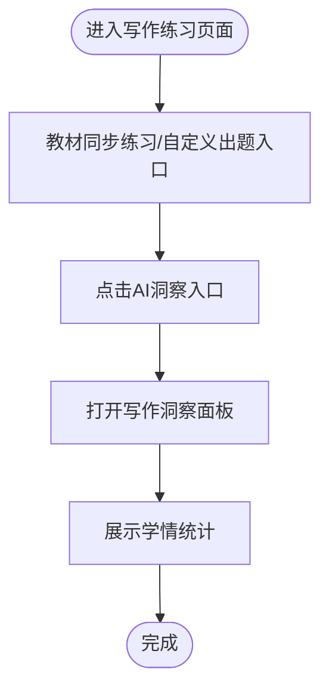

**图表来源**
- [WritingPracticePage.tsx:5-126](file://src/pages/WritingPracticePage.tsx#L5-L126)
- [SpecializedInsightEntry.tsx:119-157](file://src/ai/components/SpecializedInsightEntry.tsx#L119-L157)
- [AIAssistantDrawer.tsx:293-308](file://src/ai/components/AIAssistantDrawer.tsx#L293-L308)

**章节来源**
- [WritingPracticePage.tsx:5-126](file://src/pages/WritingPracticePage.tsx#L5-L126)
- [SpecializedInsightEntry.tsx:119-157](file://src/ai/components/SpecializedInsightEntry.tsx#L119-L157)
- [AIAssistantDrawer.tsx:293-308](file://src/ai/components/AIAssistantDrawer.tsx#L293-L308)

### 词汇教学页面（WordTeachingPage）
- 功能概述：展示单词释义、例句、关联词组、构词规律与发音规律，支持隐藏翻译、字号调节与练习入口
- 交互要点：标签页切换、隐藏翻译开关、搜索与实践按钮
- AI集成：页面顶部集成AI洞察入口，点击后打开词汇洞察面板

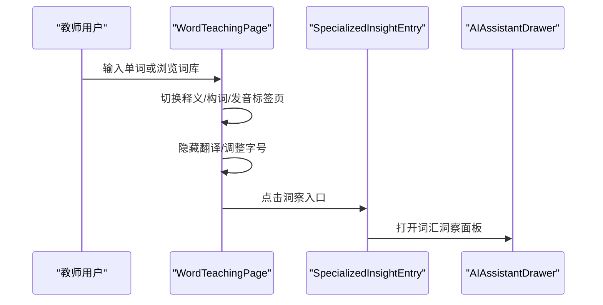

**图表来源**
- [WordTeachingPage.tsx:167-478](file://src/pages/WordTeachingPage.tsx#L167-L478)
- [SpecializedInsightEntry.tsx:119-157](file://src/ai/components/SpecializedInsightEntry.tsx#L119-L157)
- [AIAssistantDrawer.tsx:293-308](file://src/ai/components/AIAssistantDrawer.tsx#L293-L308)

**章节来源**
- [WordTeachingPage.tsx:167-478](file://src/pages/WordTeachingPage.tsx#L167-L478)
- [SpecializedInsightEntry.tsx:119-157](file://src/ai/components/SpecializedInsightEntry.tsx#L119-L157)
- [AIAssistantDrawer.tsx:293-308](file://src/ai/components/AIAssistantDrawer.tsx#L293-L308)

### AI洞察入口与AI助手抽屉
- SpecializedInsightEntry：根据类型生成洞察数据并打开对应面板
- AIAssistantDrawer：承载布置确认、生成内容预览、资源推荐等面板，支持面板栈与持久化

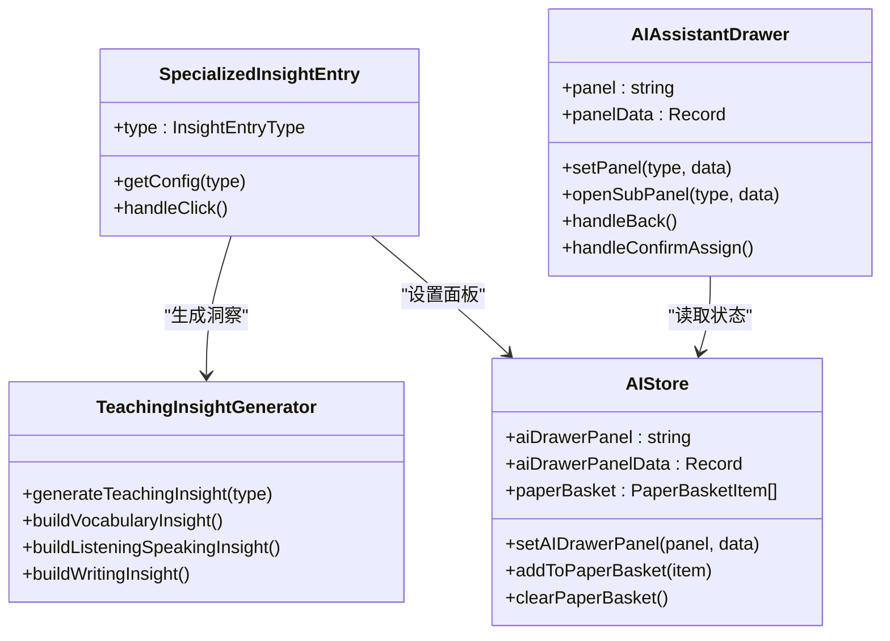

**图表来源**
- [SpecializedInsightEntry.tsx:119-157](file://src/ai/components/SpecializedInsightEntry.tsx#L119-L157)
- [AIAssistantDrawer.tsx:54-555](file://src/ai/components/AIAssistantDrawer.tsx#L54-L555)
- [teachingInsightGenerator.ts:12-19](file://src/ai/insights/teachingInsightGenerator.ts#L12-L19)
- [index.ts:140-244](file://src/ai/store/index.ts#L140-L244)

**章节来源**
- [SpecializedInsightEntry.tsx:119-157](file://src/ai/components/SpecializedInsightEntry.tsx#L119-L157)
- [AIAssistantDrawer.tsx:54-555](file://src/ai/components/AIAssistantDrawer.tsx#L54-L555)
- [teachingInsightGenerator.ts:12-19](file://src/ai/insights/teachingInsightGenerator.ts#L12-L19)
- [index.ts:140-244](file://src/ai/store/index.ts#L140-L244)

## 依赖关系分析
- 页面组件依赖AI洞察入口组件，通过统一入口触发洞察生成
- AI洞察入口依赖洞察生成器与状态管理，确保洞察数据结构统一
- AI助手抽屉依赖状态管理进行面板切换与持久化
- 特殊页面与AI助手抽屉之间通过状态管理实现松耦合通信

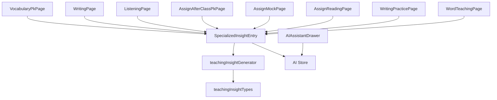

**图表来源**
- [VocabularyPkPage.tsx:1-5](file://src/pages/VocabularyPkPage.tsx#L1-L5)
- [WritingPage.tsx:1](file://src/pages/WritingPage.tsx#L1)
- [ListeningPage.tsx:1](file://src/pages/ListeningPage.tsx#L1)
- [AssignAfterClassPkPage.tsx:1-4](file://src/pages/AssignAfterClassPkPage.tsx#L1-L4)
- [AssignMockPage.tsx:1-4](file://src/pages/AssignMockPage.tsx#L1-L4)
- [AssignReadingPage.tsx:1-4](file://src/pages/AssignReadingPage.tsx#L1-L4)
- [WritingPracticePage.tsx:1-3](file://src/pages/WritingPracticePage.tsx#L1-L3)
- [WordTeachingPage.tsx:1-3](file://src/pages/WordTeachingPage.tsx#L1-L3)
- [SpecializedInsightEntry.tsx:1-5](file://src/ai/components/SpecializedInsightEntry.tsx#L1-L5)
- [teachingInsightGenerator.ts:1-10](file://src/ai/insights/teachingInsightGenerator.ts#L1-L10)
- [teachingInsightTypes.ts:1-10](file://src/ai/insights/teachingInsightTypes.ts#L1-L10)
- [index.ts:1-10](file://src/ai/store/index.ts#L1-L10)
- [AIAssistantDrawer.tsx:1-50](file://src/ai/components/AIAssistantDrawer.tsx#L1-L50)

**章节来源**
- [VocabularyPkPage.tsx:1-5](file://src/pages/VocabularyPkPage.tsx#L1-L5)
- [WritingPage.tsx:1](file://src/pages/WritingPage.tsx#L1)
- [ListeningPage.tsx:1](file://src/pages/ListeningPage.tsx#L1)
- [AssignAfterClassPkPage.tsx:1-4](file://src/pages/AssignAfterClassPkPage.tsx#L1-L4)
- [AssignMockPage.tsx:1-4](file://src/pages/AssignMockPage.tsx#L1-L4)
- [AssignReadingPage.tsx:1-4](file://src/pages/AssignReadingPage.tsx#L1-L4)
- [WritingPracticePage.tsx:1-3](file://src/pages/WritingPracticePage.tsx#L1-L3)
- [WordTeachingPage.tsx:1-3](file://src/pages/WordTeachingPage.tsx#L1-L3)
- [SpecializedInsightEntry.tsx:1-5](file://src/ai/components/SpecializedInsightEntry.tsx#L1-L5)
- [teachingInsightGenerator.ts:1-10](file://src/ai/insights/teachingInsightGenerator.ts#L1-L10)
- [teachingInsightTypes.ts:1-10](file://src/ai/insights/teachingInsightTypes.ts#L1-L10)
- [index.ts:1-10](file://src/ai/store/index.ts#L1-L10)
- [AIAssistantDrawer.tsx:1-50](file://src/ai/components/AIAssistantDrawer.tsx#L1-L50)

## 性能考虑
- 页面渲染优化：使用虚拟滚动与懒加载减少大数据集渲染压力
- 状态管理：利用局部状态与全局状态分离，避免不必要的重渲染
- AI洞察缓存：对洞察数据进行缓存，减少重复生成成本
- 事件节流：对高频交互（如搜索、筛选）进行防抖/节流处理

## 故障排除指南
- 洞察面板无法打开：检查AI Store中的面板状态与数据是否存在
- 布置确认失败：检查布置参数与网络请求状态，确认回调函数是否正确执行
- 练习篮为空：确认持久化存储是否正常，检查清空逻辑与本地存储键值

**章节来源**
- [index.ts:120-137](file://src/ai/store/index.ts#L120-L137)
- [AIAssistantDrawer.tsx:124-139](file://src/ai/components/AIAssistantDrawer.tsx#L124-L139)

## 结论
特殊页面组件通过统一的AI洞察入口与AI助手抽屉，实现了教学洞察、练习生成与布置流程的无缝衔接。页面组件专注于用户交互与数据展示，AI洞察与状态管理提供强大的数据支撑与持久化能力。开发者可基于现有框架快速扩展新的教学页面，并保持与AI系统的深度集成。

## 附录
- 教学应用场景与使用示例
  - 词汇PK：通过单词PK与拼词PK模块提升学生词汇掌握与拼写能力
  - 写作练习：利用写作洞察与AI生成作文练习，提高学生写作表达能力
  - 听力训练：通过定制听力材料与听说能力洞察，强化学生听力理解
  - 课后PK：布置课后PK练习，结合高频错词与比赛模式提升学习兴趣
  - 模拟测试：布置模拟练习，结合难度与模块筛选，满足不同层次学生需求
  - 阅读训练：通过阅读资源与主题筛选，提升学生阅读理解能力
- 个性化定制与扩展开发指南
  - 新增页面：遵循现有页面结构与命名规范，引入AI洞察入口与状态管理
  - 扩展AI洞察：在teachingInsightGenerator中新增洞察类型，在teachingInsightTypes中定义数据结构
  - 面板扩展：在AIAssistantDrawer中新增面板类型与交互逻辑，确保状态管理一致性
  - 数据持久化：利用AI Store的持久化机制，确保用户操作与配置的长期保存