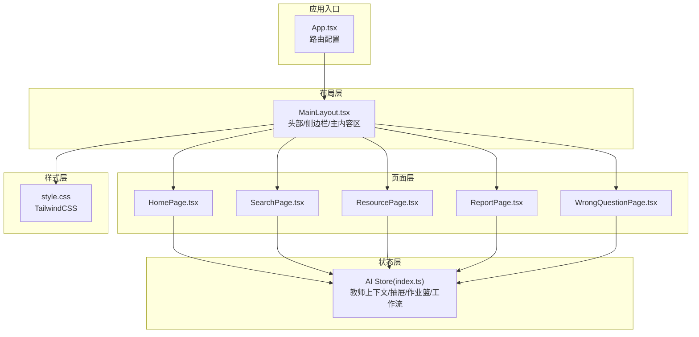
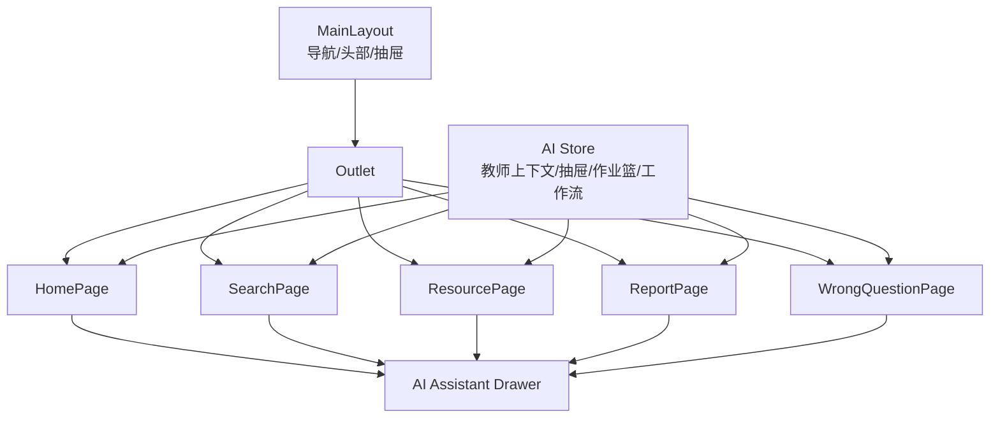
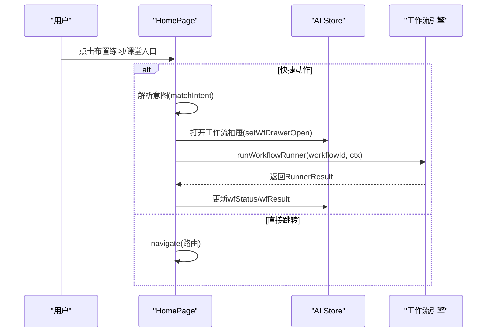
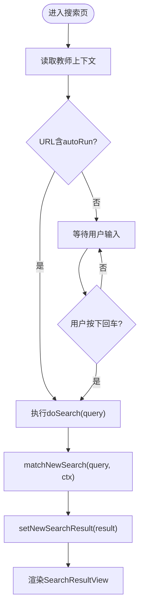
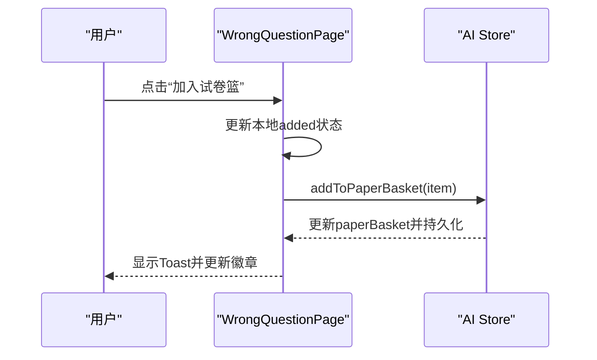
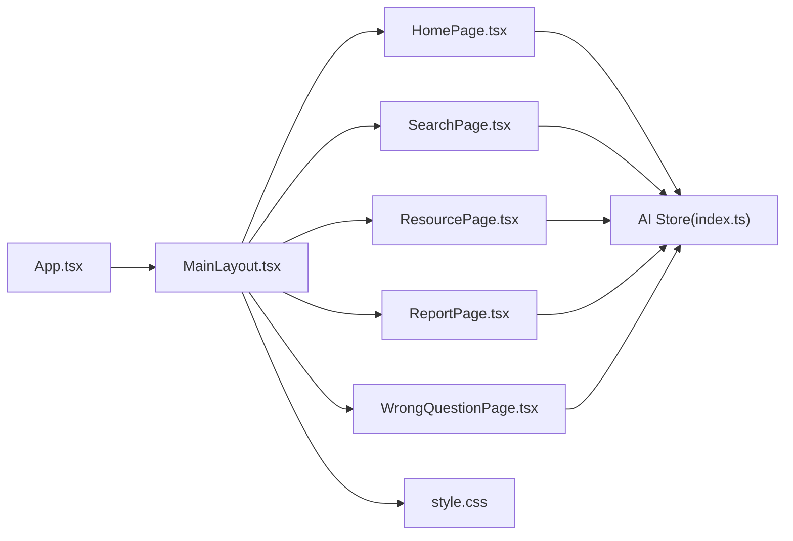

# 页面组件架构

<cite>
**本文档引用的文件**
- [App.tsx](file://src/App.tsx)
- [MainLayout.tsx](file://src/layouts/MainLayout.tsx)
- [HomePage.tsx](file://src/pages/HomePage.tsx)
- [SearchPage.tsx](file://src/pages/SearchPage.tsx)
- [ResourcePage.tsx](file://src/pages/ResourcePage.tsx)
- [ReportPage.tsx](file://src/pages/ReportPage.tsx)
- [WrongQuestionPage.tsx](file://src/pages/WrongQuestionPage.tsx)
- [index.ts](file://src/ai/store/index.ts)
- [style.css](file://src/style.css)
</cite>

## 目录
1. [引言](#引言)
2. [项目结构](#项目结构)
3. [核心组件](#核心组件)
4. [架构总览](#架构总览)
5. [详细组件分析](#详细组件分析)
6. [依赖关系分析](#依赖关系分析)
7. [性能考虑](#性能考虑)
8. [故障排除指南](#故障排除指南)
9. [结论](#结论)
10. [附录](#附录)

## 引言
本文件面向小天AI教育平台的前端页面组件架构，系统性阐述首页、搜索页面、资源页面、报告页面与错题页面等核心功能页面的设计与实现，说明布局系统与导航结构，解释页面间的数据传递与状态共享机制，给出响应式设计与用户体验优化策略，并提供扩展与自定义开发指南以及最佳实践与性能优化建议。

## 项目结构
- 应用采用 React + React Router 的单页应用架构，路由在顶层集中配置，页面组件按功能模块组织在 src/pages 下。
- 主布局 MainLayout 提供统一的头部、侧边栏导航与主内容区，所有页面在 MainLayout 包裹下运行。
- 状态管理采用 Zustand，集中管理教师上下文、AI抽屉面板、作业篮、工作流状态等跨页面共享状态。
- 样式基于 TailwindCSS，通过全局样式文件引入。

**图表来源**
- [App.tsx:28-63](file://src/App.tsx#L28-L63)
- [MainLayout.tsx:32-214](file://src/layouts/MainLayout.tsx#L32-L214)
- [index.ts:139-243](file://src/ai/store/index.ts#L139-L243)
- [style.css:1-2](file://src/style.css#L1-L2)

**章节来源**
- [App.tsx:28-63](file://src/App.tsx#L28-L63)
- [MainLayout.tsx:32-214](file://src/layouts/MainLayout.tsx#L32-L214)
- [index.ts:139-243](file://src/ai/store/index.ts#L139-L243)
- [style.css:1-2](file://src/style.css#L1-L2)

## 核心组件
- 路由与布局：App 负责路由注册，MainLayout 提供全局头部、侧边导航与主内容区，支持移动端抽屉与桌面端固定侧边栏。
- 页面组件：首页负责布置练习、课堂教学、资源推荐与练习报告；搜索页提供AI搜索与结果展示；资源页管理备课资源；报告页管理智能阅卷任务；错题页展示与筛选错题。
- 状态管理：AI Store 提供教师上下文、抽屉面板、作业篮、工作流状态、搜索结果、试卷篮等跨页面共享状态，支持本地持久化（如试卷篮）。

**章节来源**
- [App.tsx:28-63](file://src/App.tsx#L28-L63)
- [MainLayout.tsx:32-214](file://src/layouts/MainLayout.tsx#L32-L214)
- [index.ts:59-118](file://src/ai/store/index.ts#L59-L118)

## 架构总览
页面组件围绕“布局-页面-状态”三层架构协作：
- 布局层：MainLayout 统一承载导航、上下文选择与全局抽屉。
- 页面层：各页面组件聚焦业务视图与交互，复用AI能力（搜索、工作流、抽屉面板）。
- 状态层：Zustand Store 提供全局状态与持久化，页面通过 hooks 访问与更新。

**图表来源**
- [MainLayout.tsx:114-211](file://src/layouts/MainLayout.tsx#L114-L211)
- [App.tsx:32-47](file://src/App.tsx#L32-L47)
- [index.ts:140-243](file://src/ai/store/index.ts#L140-L243)

## 详细组件分析

### 首页 HomePage
- 设计目标：聚合布置练习、课堂教学、资源推荐与练习报告，提供AI搜索入口与工作流执行反馈。
- 核心功能：
  - 布置练习：网格按钮映射到不同练习类型，部分类型直接跳转，部分触发工作流。
  - 课堂教学：卡片式入口，按学科/场景展示，点击进入对应教学流程。
  - 更多课本：横向滚动展示资源卡片，支持左右滑动与标签徽章。
  - 小天AI：输入框触发AI搜索或跳转搜索页；教学关注区域展示洞察卡片。
  - 练习报告：最近练习列表，支持一键催、全屏讲解与查看报告。
- 数据与状态：
  - 使用教师上下文 teacherContext 作为工作流与搜索的上下文。
  - 通过 AI Store 控制 AI 抽屉面板与工作流结果抽屉。
- 交互与体验：
  - 按钮悬停与选中态明确，渐变背景增强视觉层次。
  - 滚动容器隐藏滚动条，提升整洁度。
  - 工作流结果抽屉提供一键布置、下载、加入篮子等操作。

**图表来源**
- [HomePage.tsx:137-158](file://src/pages/HomePage.tsx#L137-L158)
- [index.ts:97-100](file://src/ai/store/index.ts#L97-L100)

**章节来源**
- [HomePage.tsx:107-465](file://src/pages/HomePage.tsx#L107-L465)
- [index.ts:148-159](file://src/ai/store/index.ts#L148-L159)

### 搜索页面 SearchPage
- 设计目标：提供自然语言搜索入口，展示匹配结果与操作面板，支持预览、布置、加入试卷篮、加入备课等。
- 核心功能：
  - 搜索框与占位提示，支持回车触发。
  - 近期搜索与热门搜索标签，快速补全。
  - 结果区域通过 SearchResultView 渲染，支持多种操作回调。
  - 顶部显示当前教材/班级上下文，右侧显示试卷篮徽章。
- 数据与状态：
  - 从 AI Store 获取教师上下文与试卷篮，设置搜索结果与抽屉面板。
  - 支持自动运行查询参数（autoRun），避免严格模式下的重复执行。
- 交互与体验：
  - 搜索中显示加载动画，空态提供引导与快捷标签。
  - 操作反馈以 Toast 形式提示。

**图表来源**
- [SearchPage.tsx:60-88](file://src/pages/SearchPage.tsx#L60-L88)
- [index.ts:102-104](file://src/ai/store/index.ts#L102-L104)

**章节来源**
- [SearchPage.tsx:27-249](file://src/pages/SearchPage.tsx#L27-L249)
- [index.ts:102-104](file://src/ai/store/index.ts#L102-L104)

### 资源页面 ResourcePage
- 设计目标：管理备课资源，支持按来源类型、时间范围与标题搜索，支持文件夹展开与资源操作。
- 核心功能：
  - 顶部面包屑与标题，统计总数。
  - 左侧过滤器：来源类型切换、时间范围输入、搜索框。
  - 右侧新建文件夹与搜索框。
  - 列表区域：文件夹可展开/收起；资源项支持编辑、删除、上课。
- 数据与状态：
  - 使用本地数组维护资源项，支持扁平化展示与过滤。
  - 模拟操作（新建、编辑、删除、上课）。
- 交互与体验：
  - 固定右侧浮动按钮，便于快速回到主功能。
  - 源类型使用颜色标签区分，增强可读性。

**章节来源**
- [ResourcePage.tsx:75-312](file://src/pages/ResourcePage.tsx#L75-L312)

### 报告页面 ReportPage
- 设计目标：管理智能阅卷任务，支持待批阅/历史切换、分类筛选与批量操作。
- 核心功能：
  - 顶部标题与帮助入口。
  - 状态标签页：待批阅/历史。
  - 分类标签：全部/听写纸批阅/作文纸批阅/其他试卷批阅。
  - 任务列表：显示任务标题、班级、截止时间、分类标签与操作按钮。
- 数据与状态：
  - 使用本地数组模拟任务数据。
  - 模拟操作（查看报告、自动批阅、重阅记录、练习重阅）。
- 交互与体验：
  - 固定右侧浮动按钮，便于快速回到主功能。
  - 分类标签采用下划线强调当前选中项。

**章节来源**
- [ReportPage.tsx:126-302](file://src/pages/ReportPage.tsx#L126-L302)

### 错题页面 WrongQuestionPage
- 设计目标：展示与筛选错题，支持音频播放、答案解析、加入试卷篮等。
- 核心功能：
  - 顶部标签页：班级错题/学生错题。
  - 专用洞察入口：词汇类专业洞察。
  - 过滤区域：班级、时间、类型、题型等多维筛选。
  - 错题分组：按题型/来源/知识点分组展示。
  - 题目卡片：音频播放条、题干、选项、答案解析、加入/移出试卷篮。
  - 右侧浮动按钮：试卷篮计数、我的备课、折叠控制。
- 数据与状态：
  - 使用本地数组模拟错题与分组数据。
  - 模拟操作（智能组卷、我要备课、查看报告、自动批阅等）。
- 交互与体验：
  - 展开/收起过滤器，节省空间。
  - 试卷篮徽章实时显示数量。

**图表来源**
- [WrongQuestionPage.tsx:223-236](file://src/pages/WrongQuestionPage.tsx#L223-L236)
- [index.ts:214-235](file://src/ai/store/index.ts#L214-L235)

**章节来源**
- [WrongQuestionPage.tsx:251-518](file://src/pages/WrongQuestionPage.tsx#L251-L518)
- [index.ts:214-235](file://src/ai/store/index.ts#L214-L235)

## 依赖关系分析
- 路由依赖：App 负责注册所有页面路由，MainLayout 作为路由元素包裹，确保所有页面共享同一布局。
- 布局依赖：MainLayout 内置侧边导航、顶部工具栏与两个AI抽屉（小尺寸抽屉与大尺寸AI助手抽屉），页面通过导航与抽屉进行交互。
- 状态依赖：各页面通过 useAIStore 访问全局状态，包括教师上下文、抽屉面板、工作流状态、搜索结果与试卷篮等。
- 样式依赖：全局样式通过 style.css 引入 TailwindCSS，页面使用类名实现响应式布局与主题色系。

**图表来源**
- [App.tsx:32-47](file://src/App.tsx#L32-L47)
- [MainLayout.tsx:114-211](file://src/layouts/MainLayout.tsx#L114-L211)
- [index.ts:139-243](file://src/ai/store/index.ts#L139-L243)
- [style.css:1-2](file://src/style.css#L1-L2)

**章节来源**
- [App.tsx:28-63](file://src/App.tsx#L28-L63)
- [MainLayout.tsx:32-214](file://src/layouts/MainLayout.tsx#L32-L214)
- [index.ts:139-243](file://src/ai/store/index.ts#L139-L243)
- [style.css:1-2](file://src/style.css#L1-L2)

## 性能考虑
- 路由懒加载：对于未在当前布局中使用的页面（如沉浸式页面），可考虑使用动态导入进一步减少首屏体积。
- 状态粒度：AI Store 将多个状态聚合，建议按页面拆分细粒度 store 以降低不必要的重渲染。
- 列表虚拟化：资源与错题列表数据量较大时，建议引入虚拟列表以提升滚动性能。
- 图片与媒体：音频播放器与封面图应采用懒加载与缓存策略，避免阻塞主线程。
- 缓存策略：利用浏览器缓存与服务端缓存，减少重复请求。
- 动画与过渡：抽屉与加载动画使用轻量级过渡，避免复杂动画影响性能。

## 故障排除指南
- 路由不生效或空白页：检查 App 中路由注册与 MainLayout 是否正确包裹。
- 侧边栏无法打开或导航不激活：确认 MainLayout 中导航项与当前路径匹配逻辑。
- 搜索无结果或重复执行：检查 SearchPage 中 autoRun 与 doSearch 的调用时机。
- 试卷篮不持久化：确认 localStorage 写入与读取逻辑，处理异常与配额限制。
- 抽屉面板不显示：检查 AI Store 中 aiDrawerPanel 与 setAIDrawerPanel 的调用。

**章节来源**
- [App.tsx:28-63](file://src/App.tsx#L28-L63)
- [MainLayout.tsx:131-154](file://src/layouts/MainLayout.tsx#L131-L154)
- [SearchPage.tsx:60-74](file://src/pages/SearchPage.tsx#L60-L74)
- [index.ts:120-136](file://src/ai/store/index.ts#L120-L136)
- [index.ts:214-235](file://src/ai/store/index.ts#L214-L235)

## 结论
小天AI教育平台的页面组件架构以清晰的布局-页面-状态三层设计为核心，结合统一的路由与全局状态管理，实现了高效、可扩展且一致的用户体验。通过模块化的页面组件与可插拔的状态存储，开发者可以快速迭代新增页面与功能，同时保持整体架构的稳定性与可维护性。

## 附录

### 响应式设计与用户体验优化
- 响应式断点：移动端优先，侧边栏在小屏设备使用抽屉形式，桌面端固定侧边栏。
- 视觉层次：使用渐变背景与颜色标签突出关键信息，保证在不同屏幕尺寸下的一致可读性。
- 交互反馈：加载动画、Toast 提示与抽屉面板提供即时反馈，减少用户等待焦虑。
- 可访问性：按钮与输入框具备焦点样式与键盘导航支持，确保无障碍使用。

**章节来源**
- [MainLayout.tsx:114-211](file://src/layouts/MainLayout.tsx#L114-L211)
- [SearchPage.tsx:200-208](file://src/pages/SearchPage.tsx#L200-L208)
- [style.css:1-2](file://src/style.css#L1-L2)

### 页面间数据传递与状态共享机制
- 教师上下文：通过 AI Store 的 teacherContext 在所有页面共享，用于搜索与工作流。
- 抽屉面板：通过 setAIDrawerPanel 切换 AI 抽屉内容，实现跨页面联动。
- 作业篮与试卷篮：分别管理练习与资源，支持去重与持久化。
- 工作流状态：通过工作流运行状态与结果在页面与抽屉间传递。

**章节来源**
- [index.ts:66-118](file://src/ai/store/index.ts#L66-L118)
- [HomePage.tsx:112-158](file://src/pages/HomePage.tsx#L112-L158)
- [SearchPage.tsx:32-36](file://src/pages/SearchPage.tsx#L32-L36)

### 扩展与自定义开发指南
- 新增页面：在 App 中注册路由，在 MainLayout 中添加导航项，按需复用布局与抽屉。
- 新增抽屉面板：在 AI Store 中扩展面板类型与数据结构，通过 setAIDrawerPanel 切换。
- 新增过滤器：在对应页面增加筛选条件与状态，使用本地状态或全局状态管理。
- 新增持久化：如需新增持久化字段，参考试卷篮的 localStorage 实现，注意异常处理与配额限制。

**章节来源**
- [App.tsx:32-47](file://src/App.tsx#L32-L47)
- [MainLayout.tsx:23-30](file://src/layouts/MainLayout.tsx#L23-L30)
- [index.ts:120-136](file://src/ai/store/index.ts#L120-L136)
- [index.ts:214-235](file://src/ai/store/index.ts#L214-L235)