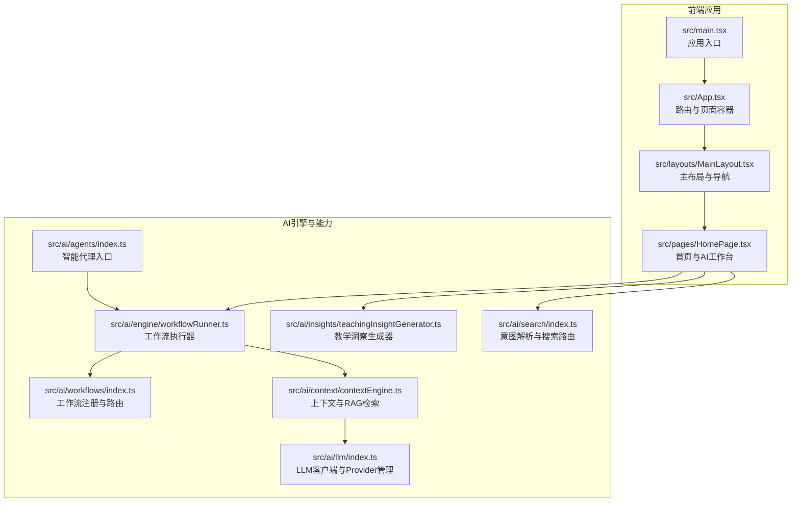
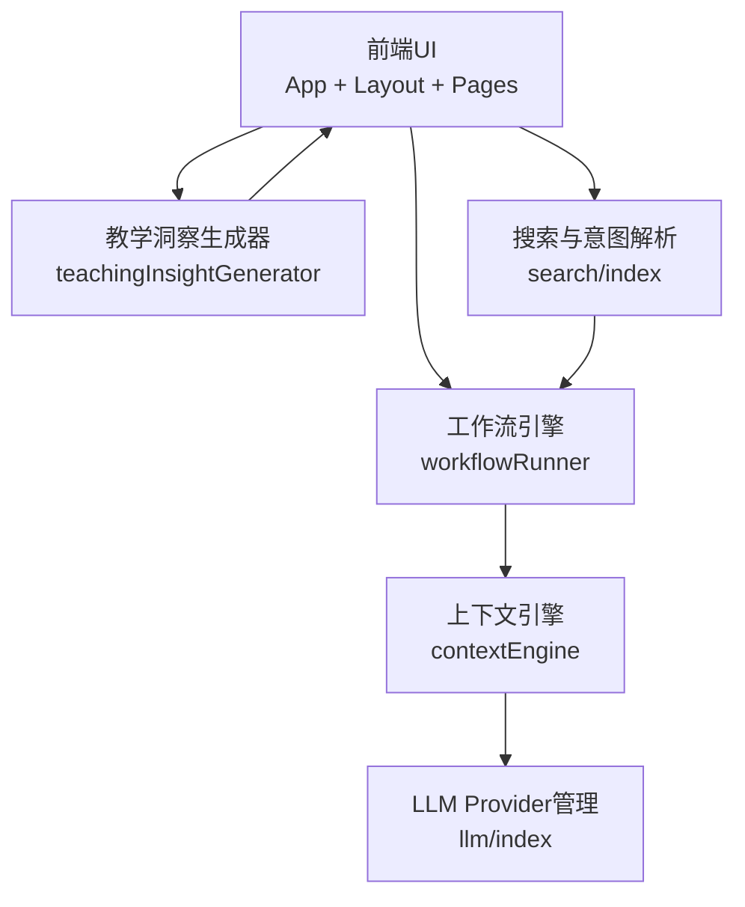
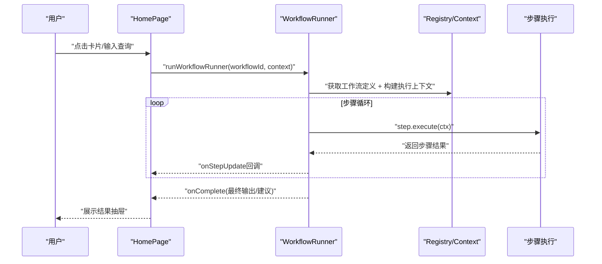
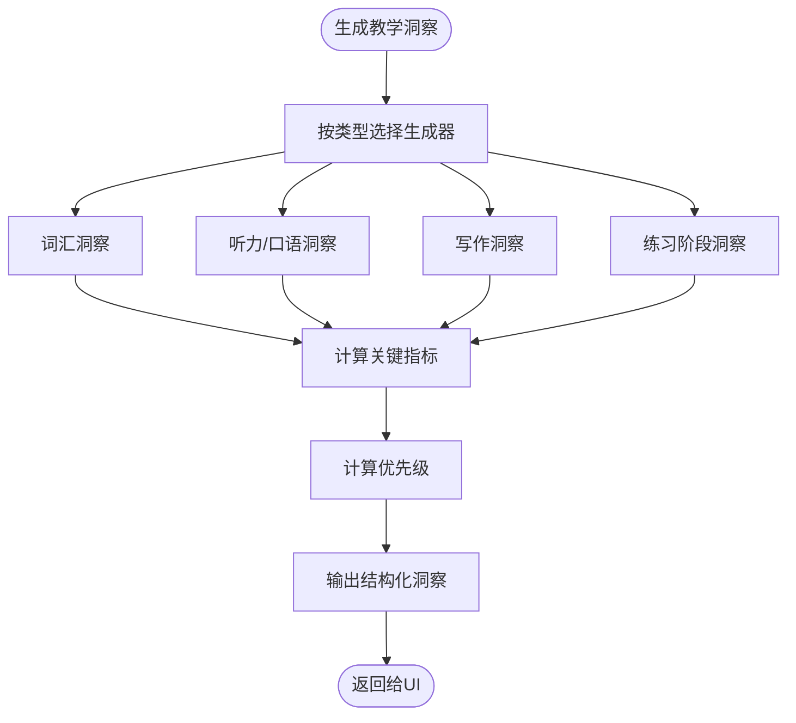
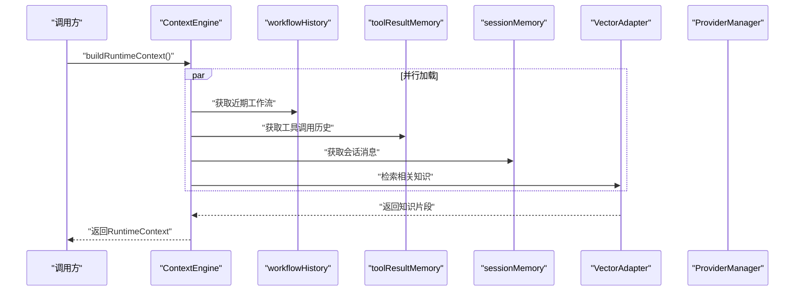
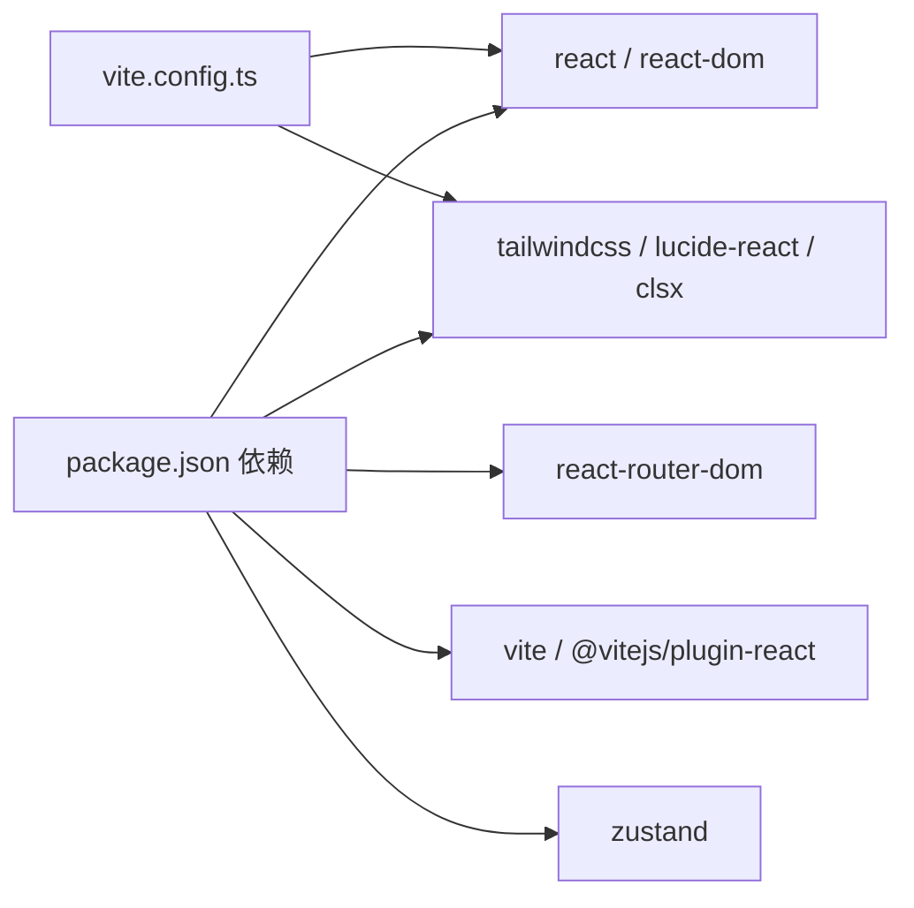

# 项目概述

<cite>
**本文引用的文件**
- [package.json](file://package.json)
- [vite.config.ts](file://vite.config.ts)
- [src/App.tsx](file://src/App.tsx)
- [src/main.tsx](file://src/main.tsx)
- [src/layouts/MainLayout.tsx](file://src/layouts/MainLayout.tsx)
- [src/pages/HomePage.tsx](file://src/pages/HomePage.tsx)
- [src/ai/engine/workflowRunner.ts](file://src/ai/engine/workflowRunner.ts)
- [src/ai/agents/index.ts](file://src/ai/agents/index.ts)
- [src/ai/insights/teachingInsightGenerator.ts](file://src/ai/insights/teachingInsightGenerator.ts)
- [src/ai/workflows/index.ts](file://src/ai/workflows/index.ts)
- [src/ai/llm/index.ts](file://src/ai/llm/index.ts)
- [src/ai/context/contextEngine.ts](file://src/ai/context/contextEngine.ts)
- [src/ai/search/index.ts](file://src/ai/search/index.ts)
- [docs/ai-insight-design.md](file://docs/ai-insight-design.md)
</cite>

## 目录
1. [引言](#引言)
2. [项目结构](#项目结构)
3. [核心组件](#核心组件)
4. [架构总览](#架构总览)
5. [详细组件分析](#详细组件分析)
6. [依赖关系分析](#依赖关系分析)
7. [性能考量](#性能考量)
8. [故障排查指南](#故障排查指南)
9. [结论](#结论)
10. [附录](#附录)

## 引言
小天AI教育平台是一个基于React 19 + TypeScript构建的AI教育应用，专注于为英语教师提供智能化的教学辅助工具。项目以“教学洞察”为核心价值主张，通过AI工作流引擎、智能代理系统与教学洞察生成功能，帮助教师在日常备课、上课、作业布置与学情分析中提升效率与质量。

- 目标用户：英语教师（初高中）
- 使用场景：布置练习、课堂讲评、学情分析、资源推荐、AI搜索与智能问答
- 技术价值：以模块化工作流驱动教学动作，以RAG检索增强教学决策，以结构化洞察指导教学实践

## 项目结构
项目采用“功能域 + 层次化”的组织方式，前端以React 19为核心，结合Vite构建与TailwindCSS样式，后端侧的AI能力以纯TS模块化实现，便于替换为真实LLM Provider。

**图表来源**
- [src/main.tsx:1-11](file://src/main.tsx#L1-L11)
- [src/App.tsx:1-64](file://src/App.tsx#L1-L64)
- [src/layouts/MainLayout.tsx:1-215](file://src/layouts/MainLayout.tsx#L1-L215)
- [src/pages/HomePage.tsx:1-465](file://src/pages/HomePage.tsx#L1-L465)
- [src/ai/engine/workflowRunner.ts:1-288](file://src/ai/engine/workflowRunner.ts#L1-L288)
- [src/ai/workflows/index.ts:1-38](file://src/ai/workflows/index.ts#L1-L38)
- [src/ai/agents/index.ts:1-26](file://src/ai/agents/index.ts#L1-L26)
- [src/ai/insights/teachingInsightGenerator.ts:1-388](file://src/ai/insights/teachingInsightGenerator.ts#L1-L388)
- [src/ai/context/contextEngine.ts:1-189](file://src/ai/context/contextEngine.ts#L1-L189)
- [src/ai/llm/index.ts:1-39](file://src/ai/llm/index.ts#L1-L39)
- [src/ai/search/index.ts:1-20](file://src/ai/search/index.ts#L1-L20)

**章节来源**
- [package.json:1-31](file://package.json#L1-L31)
- [vite.config.ts:1-12](file://vite.config.ts#L1-L12)
- [src/App.tsx:1-64](file://src/App.tsx#L1-L64)
- [src/main.tsx:1-11](file://src/main.tsx#L1-L11)

## 核心组件
- 应用入口与路由
  - 应用通过React 19与StrictMode渲染，根组件负责全局路由与页面容器。
  - 主布局提供顶部导航、侧边栏、教师身份与教材/班级选择，以及AI抽屉入口。
- 首页与AI工作台
  - 首页聚合“布置练习”、“课堂教学”、“教学关注”、“练习报告”四大区域，并内置AI搜索输入框与工作流结果抽屉。
- AI工作流引擎
  - 工作流执行器接收workflowId与教师上下文，按步骤顺序执行，支持回调与可调整参数，最终输出结构化结果与建议。
- 教学洞察生成器
  - 统一生成“练习阶段”“词汇”“听力/口语”“写作”四类教学洞察，包含优先级、指标、趋势、问题诊断、推荐动作等。
- 上下文与RAG
  - 构建运行时上下文，整合近期任务、工具调用、消息历史与向量检索的相关知识，支持Prompt注入与教学策略建议。
- LLM Provider管理
  - 提供多Provider抽象与切换机制，当前以mock实现，便于替换为真实大模型。
- 搜索与意图解析
  - 解析用户查询意图，路由到相应工作流或资源推荐，支持地区化策略与上下文提示。

**章节来源**
- [src/App.tsx:28-64](file://src/App.tsx#L28-L64)
- [src/layouts/MainLayout.tsx:32-215](file://src/layouts/MainLayout.tsx#L32-L215)
- [src/pages/HomePage.tsx:107-465](file://src/pages/HomePage.tsx#L107-L465)
- [src/ai/engine/workflowRunner.ts:103-179](file://src/ai/engine/workflowRunner.ts#L103-L179)
- [src/ai/insights/teachingInsightGenerator.ts:12-66](file://src/ai/insights/teachingInsightGenerator.ts#L12-L66)
- [src/ai/context/contextEngine.ts:37-80](file://src/ai/context/contextEngine.ts#L37-L80)
- [src/ai/llm/index.ts:1-39](file://src/ai/llm/index.ts#L1-L39)
- [src/ai/search/index.ts:1-20](file://src/ai/search/index.ts#L1-L20)

## 架构总览
系统采用“前端应用 + AI引擎 + 搜索与意图解析 + RAG上下文”的分层架构。前端负责交互与展示，AI引擎负责工作流编排与执行，搜索模块负责意图理解与路由，上下文引擎负责RAG检索与知识注入。

**图表来源**
- [src/pages/HomePage.tsx:107-465](file://src/pages/HomePage.tsx#L107-L465)
- [src/ai/engine/workflowRunner.ts:103-179](file://src/ai/engine/workflowRunner.ts#L103-L179)
- [src/ai/insights/teachingInsightGenerator.ts:12-66](file://src/ai/insights/teachingInsightGenerator.ts#L12-L66)
- [src/ai/context/contextEngine.ts:37-80](file://src/ai/context/contextEngine.ts#L37-L80)
- [src/ai/llm/index.ts:1-39](file://src/ai/llm/index.ts#L1-L39)
- [src/ai/search/index.ts:1-20](file://src/ai/search/index.ts#L1-L20)

## 详细组件分析

### 工作流执行器（WorkflowRunner）
- 职责：接收workflowId与教师上下文，构建执行上下文，按步骤顺序执行，收集步骤结果与建议，输出结构化结果。
- 关键特性：
  - 支持步骤回调与错误中断，保证流程可观测性。
  - 输出包含可调整参数（如题目数量、难度），便于教师定制。
  - 与LLM解耦，当前以mock实现，未来可无缝替换为真实工具调用。
- 典型调用链：首页卡片/搜索触发 → 意图匹配 → 工作流执行 → 结果抽屉展示。

**图表来源**
- [src/pages/HomePage.tsx:137-158](file://src/pages/HomePage.tsx#L137-L158)
- [src/ai/engine/workflowRunner.ts:103-179](file://src/ai/engine/workflowRunner.ts#L103-L179)

**章节来源**
- [src/ai/engine/workflowRunner.ts:103-179](file://src/ai/engine/workflowRunner.ts#L103-L179)

### 教学洞察生成器（TeachingInsightGenerator）
- 职责：统一生成四类教学洞察（练习阶段、词汇、听力/口语、写作），包含优先级、关键指标、趋势分析、问题诊断与推荐动作。
- 设计思想：
  - 以“数据依据 + 教研判断 + 可执行动作”为主线，避免空泛建议。
  - 对不同模块设定阈值与规则，确保洞察可落地。
- 与首页联动：首页展示“教学关注”，点击后打开对应洞察面板。

**图表来源**
- [src/ai/insights/teachingInsightGenerator.ts:12-66](file://src/ai/insights/teachingInsightGenerator.ts#L12-L66)
- [src/pages/HomePage.tsx:21-29](file://src/pages/HomePage.tsx#L21-L29)

**章节来源**
- [src/ai/insights/teachingInsightGenerator.ts:12-66](file://src/ai/insights/teachingInsightGenerator.ts#L12-L66)
- [src/pages/HomePage.tsx:21-29](file://src/pages/HomePage.tsx#L21-L29)

### 上下文引擎与RAG（ContextEngine）
- 职责：构建运行时上下文，聚合近期工作流、工具调用、消息历史，并通过向量检索获取相关教学知识，注入Prompt。
- 特性：
  - 并行加载近期历史与向量知识，提升响应速度。
  - 提供降级知识库，保障在向量服务不可用时仍可工作。
  - 支持地区化过滤与检索参数控制。

**图表来源**
- [src/ai/context/contextEngine.ts:37-80](file://src/ai/context/contextEngine.ts#L37-L80)
- [src/ai/context/contextEngine.ts:94-133](file://src/ai/context/contextEngine.ts#L94-L133)

**章节来源**
- [src/ai/context/contextEngine.ts:37-80](file://src/ai/context/contextEngine.ts#L37-L80)
- [src/ai/context/contextEngine.ts:94-133](file://src/ai/context/contextEngine.ts#L94-L133)

### 搜索与意图解析（Search）
- 职责：解析用户查询，识别意图，路由到相应工作流或资源推荐，支持地区化策略与上下文提示。
- 与工作流联动：首页的AI搜索输入框可直接触发工作流执行与结果展示。

**章节来源**
- [src/ai/search/index.ts:1-20](file://src/ai/search/index.ts#L1-L20)
- [src/pages/HomePage.tsx:118-173](file://src/pages/HomePage.tsx#L118-L173)

### 智能代理系统（Agents）
- 职责：作为AI工作流的“智能编排者”，负责规划、工具调用、记忆与评审等环节，当前与工作流引擎协同，逐步过渡到以代理为核心的执行模式。
- 与工作流的关系：代理系统通过注册表与执行器与工作流解耦，便于扩展与替换。

**章节来源**
- [src/ai/agents/index.ts:1-26](file://src/ai/agents/index.ts#L1-L26)

## 依赖关系分析
- 前端依赖
  - React 19、React Router、TailwindCSS、Framer Motion、Lucide React、Zustand等。
- 构建与开发
  - Vite + TailwindCSS插件，本地开发服务器配置允许局域网访问。
- AI模块依赖
  - 工作流引擎与上下文引擎相互依赖，上下文引擎依赖向量适配器与Provider管理。
  - 搜索模块与工作流模块解耦，通过意图匹配与路由连接。

**图表来源**
- [package.json:11-29](file://package.json#L11-L29)
- [vite.config.ts:1-12](file://vite.config.ts#L1-L12)

**章节来源**
- [package.json:11-29](file://package.json#L11-L29)
- [vite.config.ts:1-12](file://vite.config.ts#L1-L12)

## 性能考量
- 并行加载：上下文引擎在构建运行时上下文时并行获取近期工作流、工具调用、消息历史与向量知识，减少等待时间。
- 步骤可观测：工作流执行器在每步完成后回调UI，便于即时反馈与性能监控。
- 降级策略：当向量检索失败时，上下文引擎提供降级知识库，确保系统可用性。
- UI优化：首页采用抽屉与网格布局，结合动画与滚动容器，兼顾可用性与性能。

[本节为通用性能讨论，无需特定文件来源]

## 故障排查指南
- 工作流执行失败
  - 现象：步骤执行抛错导致流程中断。
  - 排查：检查步骤回调中的错误信息，定位失败步骤；确认上下文参数是否完整。
  - 参考：工作流执行器的错误回调与失败结果构造。
- 搜索意图不匹配
  - 现象：输入查询未命中预期工作流。
  - 排查：检查意图解析与工作流匹配逻辑；确认查询关键词与工作流标签一致。
- 洞察为空或不显示
  - 现象：首页“教学关注”为空或不展示。
  - 排查：检查洞察生成规则与阈值；确认当前班级/单元/学情数据是否满足触发条件。
- 向量检索异常
  - 现象：RAG知识缺失或报错。
  - 排查：确认向量适配器可用性与过滤参数；检查降级知识库是否生效。

**章节来源**
- [src/ai/engine/workflowRunner.ts:205-220](file://src/ai/engine/workflowRunner.ts#L205-L220)
- [src/ai/context/contextEngine.ts:129-133](file://src/ai/context/contextEngine.ts#L129-L133)

## 结论
小天AI教育平台以“教学洞察”为核心，结合AI工作流引擎、智能代理系统与RAG上下文，为英语教师提供从“布置练习”到“课堂讲评”再到“学情分析”的全链路智能辅助。项目采用模块化与可替换的设计，既满足初学者快速理解，也为有经验的开发者提供了深入扩展的空间。

[本节为总结性内容，无需特定文件来源]

## 附录
- 教育导向设计思想
  - 以“教研判断 + 可执行动作”为导向，避免空泛建议；强调“数据依据 + 教研经验 + 实践路径”闭环。
  - 通过地区化规则与教学策略库，确保建议贴合实际教学场景。
- 创新点
  - 工作流与代理解耦，便于替换为真实LLM与工具调用。
  - RAG检索增强上下文，使教学建议具备更强的“情境感知”。
  - 结构化洞察与动作库统一，降低教师使用门槛。

**章节来源**
- [docs/ai-insight-design.md:1-622](file://docs/ai-insight-design.md#L1-L622)