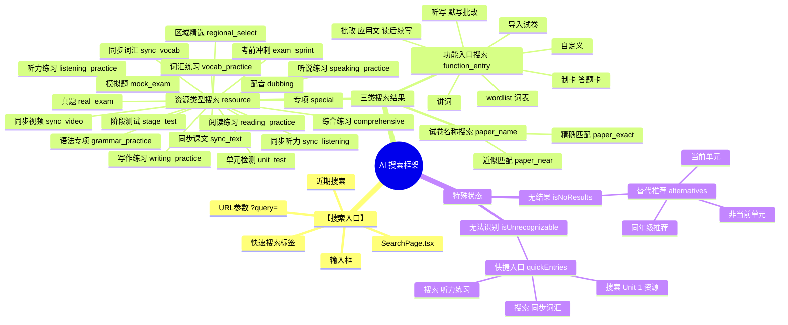
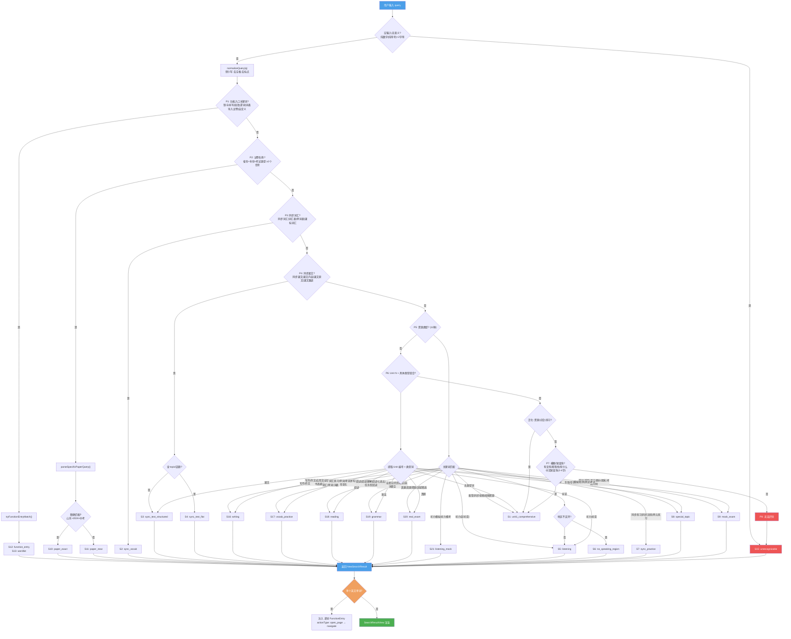
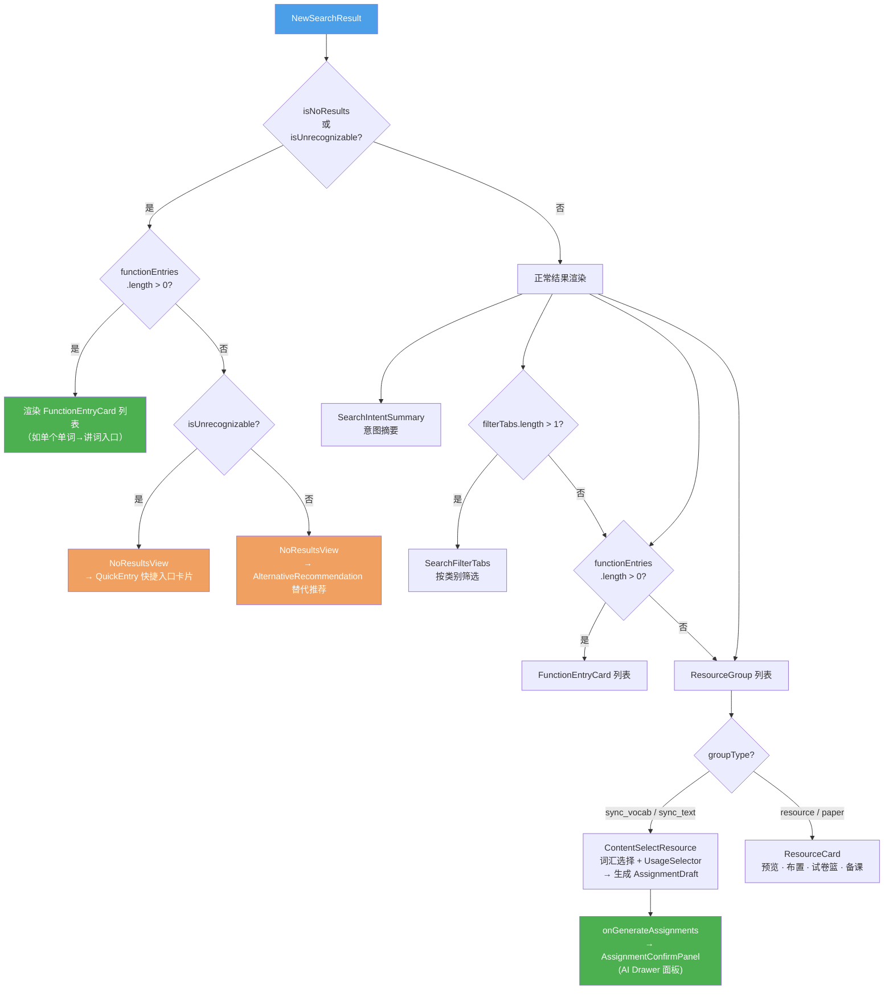

# AI 搜索功能规格说明书

> 版本：V1.0 | 日期：2026-06-10 | 分支：feature/writing-insight

---

## 1. 功能概述

AI 搜索是小天智能助手的核心功能入口之一，支持老师输入自然语言查询，返回 **三类搜索结果**：资源类型搜索、试卷名称搜索、功能入口搜索。

**页面路由**：`/search` 和 `/ai-search`（均指向 `SearchPage.tsx`）

---

## 2. 搜索框架全景图（脑图）



---

## 3. 搜索引擎 — 8级匹配决策流程



---

## 4. 搜索结果 → UI 渲染分发逻辑



---

## 5. 搜索数据流架构

```
用户输入 query
    │
    ▼
┌─────────────────────┐
│  SearchPage.tsx      │  ← 页面层：输入框、近期搜索、快速搜索标签
│  调用 doSearch(q)    │
└─────────┬────────────┘
          │
          ▼
┌─────────────────────┐
│  searchEngine.ts     │  ← 搜索引擎：8级规则匹配（详见上方流程图）
│  matchNewSearch()    │
└─────────┬────────────┘
          │
          ▼
┌─────────────────────┐
│  scenarios.ts        │  ← 15个场景工厂函数
│  SCENARIO_MAP[...]() │     每个函数返回完整 NewSearchResult
└─────────┬────────────┘
          │
          ▼
┌─────────────────────┐
│  mock/data.ts        │  ← Mock 数据：资源、词汇、课文、功能入口
│  MOCK_RESOURCES[]    │
│  MOCK_VOCAB_UNIT_*[] │
│  MOCK_FUNCTION_ENTRY │
└─────────┬────────────┘
          │
          ▼
┌─────────────────────┐
│  SearchResultView    │  ← 渲染层：意图摘要 + 筛选Tab + 资源组 + 功能入口
│  ├ SearchIntentSummary  │
│  ├ SearchFilterTabs     │
│  ├ ResourceGroup        │
│  │   ├ ResourceCard (普通资源)
│  │   └ ContentSelectResource (同步词汇/课文)
│  ├ FunctionEntryCard    │
│  └ NoResultsView        │
└─────────────────────┘
```

---

## 6. 8 级搜索匹配规则

### 6.1 规则总览

| 优先级 | 规则 | 触发条件 | 场景 |
|--------|------|---------|------|
| P1 | 功能入口 | `制卡\|听写\|批改\|讲词\|词表\|导入试卷\|自定义` | `function_entry` / `wordlist` |
| P2 | 试卷名称 | 省份+年份+考试类型（≥2个信号） | `paper_exact` / `paper_near` |
| P3 | 同步词汇 | `同步词汇\|词汇表\|单词表\|课标词汇\|单词列表` | `sync_vocab` |
| P4 | 同步课文 | `同步课文\|课文内容\|课文原文\|课文跟读` | `sync_text_structured` / `sync_text_flat` |
| P5 | 资源类型（11种） | 见下表 | 见下表 |
| P6 | Unit N + 类型组合 | `Unit N` / `第N单元` + 类型词（听力/词汇/语法/写作/阅读/课文/模拟/真题/专项） | 按类型词分发 |
| P7 | 模糊搜索 | `有没有\|帮我找\|有什么` / 中文短查询(2-4字) | `unit1_comprehensive` |
| P8 | 无法识别 | 以上均不匹配 / 纯数字 / 纯符号 / 空输入 | `unrecognizable` |

### 6.2 P5 资源类型——11种子规则

| # | 规则 | 关键词（正则） | 场景 |
|---|------|---------|------|
| 5a | 写作练习 | `写作练习\|作文\|应用文\|读后续写\|书面表达` | S16 `writing` |
| 5b | 词汇练习 | `词汇练习\|单词\|单词拼写\|词形变化\|单词默写\|单词听写` | S17 `vocab_practice` |
| 5c | 语法练习 | `语法\|语法填空\|完形填空\|选词填空\|短文填空\|单句语法` | S19 `grammar` |
| 5d | 阅读练习 | `阅读理解\|阅读练习\|阅读七选五\|任务型阅读\|英语阅读` | S18 `reading` |
| 5e | 听力模拟 | `听力模拟\|听力模考` | S21 `listening_mock` |
| 5f | 听力搜索 | `^听力$\|听力资源\|听力练习\|听力训练\|听力素材`（排除"听说"） | S5 `listening` |
| 5g | 听说搜索 | `听说练习\|听说训练\|听说资源\|听说` | S5 `listening` / S6 `no_speaking_region` |
| 5h | 同步练习 | `同步练习\|同步训练\|单元练习` | S7 `sync_practice` |
| 5i | 真题+区域 | `^真题$\|真题资源\|真题库\|历年真题\|区域精选` | S20 `real_exam` |
| 5j | 专项搜索 | `专项\|专项训练\|…专项` | S8 `special_topic` |
| 5k | 模拟+考试 | `模拟\|期末\|期中\|摸底\|单元检测\|阶段测试\|考前冲刺` | S9 `mock_exam` |
| 5l | 配音+视频 | `配音\|同步视频\|视频资源\|趣味配音` | S1 `comprehensive` |

### 6.3 P6 Unit N + 具体类型组合

当查询中包含单元编号（`Unit N` / `第N单元` / `单元`）且同时包含类型词时，按类型词分发到对应场景：

| 类型词 | 分发场景 |
|--------|---------|
| 听力、听说 | S5 `listening` |
| 词汇、单词、词表 | S17 `vocab_practice` |
| 语法 | S19 `grammar` |
| 写作、作文 | S16 `writing` |
| 阅读 | S18 `reading` |
| 课文 | S3 `sync_text_structured` |
| 模拟、检测、测试、考试 | S9 `mock_exam` |
| 真题 | S20 `real_exam` |
| 专项 | S8 `special_topic` |
| 无类型词 | S1 `unit1_comprehensive` |

### 6.4 边界处理

| 输入类型 | 处理 |
|---------|------|
| 空输入 | → P8 unrecognizable |
| 纯数字（如 `123`） | → P8 unrecognizable |
| 纯特殊符号（如 `!!!`） | → P8 unrecognizable |
| 单个英文字母 | → P8 unrecognizable |
| 单个英文单词（如 `welcome`） | 引擎返回 unrecognizable → SearchPage 层注入「讲词」FunctionEntry |

---

## 7. 搜索类型定义

### 4.1 SearchType（4类）

| 类型 | 说明 |
|------|------|
| `resource` | 资源类型搜索（默认主类型） |
| `paper_name` | 具体试卷名称搜索 |
| `function_entry` | 功能入口搜索 |
| `unknown` | 无法识别 |

### 4.2 SearchResourceCategory（22 种资源类别）

```
sync_vocab      同步词汇        sync_text        同步课文
sync_listening  同步听力        listening_practice 听力练习
speaking_practice 听说练习      listening_mock    听力模拟
vocab_practice  词汇练习        grammar_practice  语法专项
writing_practice 写作练习       reading_practice  阅读练习
comprehensive   综合练习        unit_test         单元检测
stage_test      阶段测试        mock_exam         模拟题
real_exam       真题            special           专项
dubbing         配音            sync_video        同步视频
exam_sprint     考前冲刺        regional_select   区域精选
function        功能入口
```

---

## 8. 核心数据类型

### 5.1 搜索结果 `NewSearchResult`

```typescript
interface NewSearchResult {
  intent: SearchIntentInfo           // 意图摘要
  filterTabs: FilterTab[]            // 筛选标签
  resourceGroups: ResourceGroup[]    // 资源分组
  functionEntries: FunctionEntry[]   // 功能入口列表
  alternatives?: AlternativeRecommendation[]  // 无结果时的替代推荐
  quickEntries?: QuickEntry[]        // 无法识别时的快捷入口
  isNoResults: boolean               // 是否无结果
  isUnrecognizable: boolean          // 是否完全无法识别
}
```

### 5.2 资源项 `ResourceItem`

```typescript
interface ResourceItem {
  id: string
  title: string
  type: SearchResourceCategory
  tags: string[]
  questionCount?: number      // 题量
  duration?: string           // 预计用时
  difficulty: 'basic' | 'medium' | 'advanced'
  grade: string
  source?: string             // 来源
  isCurrentUnit: boolean      // 是否匹配当前教学单元
  recommendReason?: string    // AI推荐理由
  canPreview: boolean         // 是否可预览
  canAssign: boolean          // 是否可布置
  canAddToPaperBasket: boolean // 是否可加入试卷篮
  canAddToLessonPrep: boolean // 是否可加入备课
  isLessonPrepResource: boolean // 是否为备课型资源
  contentData?: SyncVocabData | SyncTextData  // 同步词汇/课文内容
  paperMeta?: PaperMeta       // 试卷元数据
}
```

### 5.3 功能入口 `FunctionEntry`

```typescript
interface FunctionEntry {
  id: string
  name: string                // 入口名称，如"讲词"
  keywords: string[]          // 匹配关键词
  category: string            // 分类，如"词汇教学"
  recommendReason: string     // 推荐理由
  actionType: 'navigate' | 'open_drawer' | 'open_function' | 'open_page'
  openTarget?: string         // 跳转目标路径
}
```

### 5.4 试卷篮 `PaperBasketItem`

```typescript
interface PaperBasketItem {
  id: string
  resourceId: string          // 用于去重
  title: string
  type: SearchResourceCategory
  addedAt: number
}
```

---

## 9. 组件层级

```
SearchPage.tsx                              ← 页面入口
├── 顶部上下文栏（教材·年级·单元·班级）
├── PaperBasketBadge                        ← 试卷篮角标
├── 描述文案："输入教学问题..."
├── 搜索框 + 快速搜索标签 + 近期搜索
├── 搜索中状态："小天正在理解你的意图..."
├── SearchResultView                       ← 结果容器
│   ├── SearchIntentSummary                ← 意图摘要（含搜索类型、匹配类型）
│   ├── SearchFilterTabs                   ← 筛选标签（全部/同步听力/词汇练习...）
│   ├── FunctionEntryCard[]                ← 功能入口卡片
│   ├── ResourceGroup[]                    ← 资源分组
│   │   ├── ResourceCard                   ← 普通资源卡片（预览/布置/试卷篮/备课）
│   │   └── ContentSelectResource           ← 内容选择型资源（同步词汇/课文 + 用途选择器）
│   └── NoResultsView                      ← 无结果视图
│       ├── QuickEntry cards               ← 无法识别时显示快捷入口
│       └── AlternativeRecommendation[]    ← 有替代推荐时显示
└── Toast（底部居中，2.5秒自动消失）
```

---

## 10. 交互闭环状态

### 7.1 已闭环 ✅

| 功能 | 状态 | 说明 |
|------|------|------|
| 搜索输入 | ✅ | 支持 Enter 搜索、快速标签点击、近期搜索点击 |
| 讲词功能入口 | ✅ | 搜索单个英文单词时注入讲词FunctionEntry，`actionType: 'open_page'` → `navigate('/word-teaching/:word')` |
| 试卷篮 | ✅ | localStorage 持久化，`resourceId` 去重，Badge 显示计数 |
| 内容选择型资源 | ✅ | 同步词汇/课文支持选择+用途+生成布置草案 |
| 搜索框清除 | ✅ | X 按钮清除 query 和 result |
| tag点击搜索 | ✅ | `handleTagClick` 先 `setResult(null)` 再 `doSearch` |
| 结果筛选 | ✅ | FilterTabs 按类别筛选 resourceGroups |
| 分组展开折叠 | ✅ | ResourceGroup 的 expand/collapse + showAll |
| 无结果处理 | ✅ | 替代推荐（当前单元/同年级/非当前单元）+ 快捷入口 |
| 无法识别处理 | ✅ | QuickEntry 快捷入口卡片 |

### 7.2 未闭环 ❌

| 功能 | 严重度 | 说明 |
|------|--------|------|
| **预览** | HIGH | `mockOpenPreview()` → toast 提示，无真实预览面板 |
| **布置** | HIGH | `mockOpenAssignDialog()` → toast 提示，无真实布置弹窗 |
| **加入备课** | HIGH | `mockAddToLessonPrep()` → toast 提示，未接入备课能力 |
| **功能入口**(非open_page) | HIGH | `mockOpenFunction()` → toast 提示 |
| **近期搜索** | LOW | 硬编码数组，不反映真实搜索历史 |
| **试卷篮toast** | MEDIUM | `paperBasketToast` 在 store 中设置但 UI 未消费 |

---

## 11. 数据流

### 8.1 搜索上下文

```typescript
// 从 useAIStore 读取教师上下文
const ctx: SearchContext = {
  textbook: teacherContext.textbook,      // 教材版本，如"人教版"
  unit: teacherContext.unit,              // 教学单元，如"Unit 1"
  grade: teacherContext.grade,            // 年级
  className: teacherContext.className,    // 班级名
  studentCount: teacherContext.studentCount,
}
```

### 8.2 搜索流程

```
1. 用户在 SearchPage 输入 query
2. doSearch(query) 执行
3. 400ms 模拟延迟后，matchNewSearch(q, ctx) 返回 NewSearchResult
4. 如果是单个英文单词 → 注入讲词 FunctionEntry
5. 结果存入 state.result（页面状态）+ store.newSearchResult（全局状态）
6. SearchResultView 渲染结果
```

### 8.3 操作流程

| 操作 | 数据流向 |
|------|---------|
| 预览 | `onPreview(item)` → `mockOpenPreview()` → toast |
| 布置 | `onAssign(item)` → `mockOpenAssignDialog()` → toast |
| 加入试卷篮 | `onAddToPaperBasket(item)` → `store.addToPaperBasket()` → localStorage |
| 加入备课 | `onAddToLessonPrep(item)` → `mockAddToLessonPrep()` → toast |
| 打开功能 | `onOpenFunction(entry)` → 如果 `actionType=open_page` → `navigate(openTarget)`，否则 toast |
| 生成布置 | `onGenerateAssignments(drafts)` → `store.setPendingAssignments()` → 打开 `assignmentConfirmNew` drawer panel |
| 快捷入口 | `onQuickEntry(entry)` → `setQuery(entry.searchQuery)` → `doSearch()` |

---

## 12. 搜索场景一览（21 种）

| 场景ID | 场景函数 | 说明 |
|--------|---------|------|
| S1 | `unit1_comprehensive` | Unit N 综合资源搜索（默认） |
| S2 | `sync_vocab` | 同步词汇+语块内容选择 |
| S3 | `sync_text_structured` | 同步课文（分层树结构） |
| S4 | `sync_text_flat` | 同步课文（平铺按话题） |
| S5 | `listening` | 听力资源搜索 |
| S6 | `no_speaking_in_region` | 听说练习无结果（地区不支持） |
| S7 | `sync_practice` | 同步练习搜索 |
| S8 | `special_topic` | 专项练习搜索 |
| S9 | `mock_exam` | 模拟题/单元检测/阶段测试/考前冲刺/期末考试 |
| S10 | `paper_exact` | 试卷精确匹配（如山东2024中考） |
| S11 | `paper_near` | 试卷近似匹配 |
| S12 | `function_entry` | 功能入口（制卡/听写/批改/讲词等） |
| S13 | `wordlist` | 词表功能入口 |
| S14 | `no_results_alternatives` | 无结果替代推荐 |
| S15 | `unrecognizable` | 完全无法识别 |
| S16 | `writing` | **新增** 写作练习搜索 |
| S17 | `vocab_practice` | **新增** 词汇练习搜索 |
| S18 | `reading` | **新增** 阅读练习搜索 |
| S19 | `grammar` | **新增** 语法练习搜索 |
| S20 | `real_exam` | **新增** 真题独立搜索 |
| S21 | `listening_mock` | **新增** 听力模拟搜索 |

---

## 13. 试卷篮设计

### 10.1 数据结构

```typescript
// Store 中
paperBasket: PaperBasketItem[]    // localStorage 持久化
addToPaperBasket(item)            // 添加（resourceId 去重）
removeFromPaperBasket(id)         // 移除
clearPaperBasket()                // 清空
```

### 10.2 接入点

| 页面/组件 | 操作 |
|----------|------|
| SearchPage → ResourceCard | 加入试卷篮 |
| WritingInsightPage → RecommendedWritingResourcesSection | 加入试卷篮 |
| AIAssistantDrawer | 加入试卷篮 |
| SearchPage → PaperBasketBadge | 点击打开 `basket` drawer panel |
| MainLayout → BasketView | 查看/清空试卷篮 |

### 10.3 注意事项

- ID 生成为 `pb-{item.id}-{Date.now()}`，每次添加生成不同 id
- 去重用 `resourceId` 字段，相同的 `resourceId` 不允许重复加入
- `isInPaperBasket` 也使用 `resourceId` 匹配，保证 UI 状态正确

---

## 14. 关键文件清单

| 文件 | 说明 |
|------|------|
| `src/pages/SearchPage.tsx` | 搜索页面（275行） |
| `src/ai/search-new/searchEngine.ts` | 搜索引擎（8级规则匹配） |
| `src/ai/search-new/types.ts` | 类型定义（383行） |
| `src/ai/search-new/mock/scenarios.ts` | 15个场景工厂函数 |
| `src/ai/search-new/mock/data.ts` | Mock数据（资源/词汇/课文/功能入口） |
| `src/ai/components/search-new/SearchResultView.tsx` | 搜索结果渲染容器 |
| `src/ai/components/search-new/ResourceCard.tsx` | 资源卡片 |
| `src/ai/components/search-new/ResourceGroup.tsx` | 资源分组（展开/折叠） |
| `src/ai/components/search-new/FunctionEntryCard.tsx` | 功能入口卡片 |
| `src/ai/components/search-new/NoResultsView.tsx` | 无结果视图 |
| `src/ai/components/search-new/SearchFilterTabs.tsx` | 筛选标签 |
| `src/ai/components/search-new/SearchIntentSummary.tsx` | 意图摘要 |
| `src/ai/components/search-new/ContentSelectResource.tsx` | 内容选择型资源 |
| `src/ai/components/search-new/UsageSelector.tsx` | 用途选择器 |
| `src/ai/components/search-new/AssignmentConfirmPanel.tsx` | 布置确认面板 |
| `src/ai/components/search-new/SyncVocabSection.tsx` | 同步词汇选择区 |
| `src/ai/components/search-new/SyncTextSection.tsx` | 同步课文选择区 |
| `src/ai/components/search-new/SuccessFeedbackCard.tsx` | 成功反馈卡片 |
| `src/ai/components/search-new/PaperBasketBadge.tsx` | 试卷篮角标（在SearchPage顶部） |
| `src/ai/store/index.ts` | 全局Store（paperBasket、newSearchResult、pendingAssignments） |
| `src/ai/components/AIAssistantDrawer.tsx` | AI抽屉（basket面板、assignmentConfirmNew面板） |

---

## 15. 接入真实数据建议

| 项目 | 当前状态 | 需要对接 |
|------|---------|---------|
| 搜索匹配 | 规则匹配，字段硬编码 | 可保留规则逻辑，替换场景函数从API拉数据 |
| 资源数据 | static mock data.ts | 替换为 API 查询接口 |
| 预览/布置 | toast mock | 对接教师端现有预览/布置能力 |
| 试卷篮 | ✅ localStorage 已完成 | 可选升级：服务端同步 |
| 近期搜索 | 硬编码数组 | 接入 localStorage 或后端搜索历史 |
| 教材上下文 | store 中 teacherContext | 对接用户系统 |
